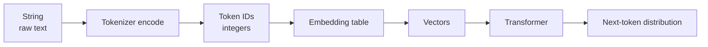
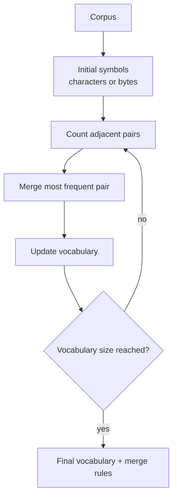

# Lecture 1: Overview and Tokenization

> 课程来源：`context/01 - Lecture 1  Overview, Tokenization.json`
>
> 本讲目标不是把课堂内容压缩成摘要，而是把第一讲中涉及的技术概念展开成可复习、可教学的讲义。专业术语保留英文原词。

## 0. 本讲学习目标

完成本讲后，应当能够回答以下问题：

- 为什么 CS336 把语言模型训练看作一个完整系统，而不仅是一个 Transformer 模型？
- 为什么小规模语言模型实验不能总是代表 frontier model 的行为？
- 为什么课程反复强调 efficiency，即在固定 compute budget 下最大化模型质量？
- 语言模型训练 pipeline 包括哪些关键模块？
- Tokenizer 在语言模型中扮演什么角色？
- Character-level、byte-level、word-level tokenization 各有什么问题？
- Byte Pair Encoding / BPE 为什么是现代 LLM 中常见的实用折中？
- Byte-level BPE 如何同时解决 unknown token 和词表爆炸问题？
- 如果未来摆脱显式 tokenizer，新的端到端方案仍必须满足什么条件？

## 1. 课程全景：从零构建语言模型

CS336 的核心主张是：理解语言模型不能只理解 Transformer block，而要理解整个训练和部署系统。一个现代 language model 至少由以下环节共同决定：

```mermaid
flowchart LR
    A[Raw data<br/>HTML / PDF / code / books / web] --> B[Data processing<br/>extraction / filtering / deduplication]
    B --> C[Tokenizer<br/>text to token ids]
    C --> D[Architecture<br/>Transformer / MoE / attention variants]
    D --> E[Training loop<br/>loss / optimizer / initialization]
    E --> F[Systems<br/>kernels / GPUs / parallelism]
    F --> G[Scaling laws<br/>compute allocation / prediction]
    G --> H[Evaluation<br/>perplexity / benchmarks / human preference]
    H --> I[Post-training<br/>SFT / RLHF / RLVR]
    I --> J[Inference<br/>serving / KV cache / batching]
```



这条链条的关键含义是：任何一个局部设计选择都可能通过成本、数据分布、训练稳定性或推理效率影响最终模型质量。例如：

- Tokenizer 决定文本被压缩成多少个 tokens，从而影响 context length、训练 FLOPs 和推理成本。
- Architecture 决定每个 token 需要多少计算，以及模型能否高效利用 GPU。
- Data filtering 决定固定训练预算中有多少计算被花在高质量样本上。
- Scaling laws 决定在大规模训练前如何用小实验预测大实验。
- Inference 需求可能反过来改变训练策略，例如训练一个更小但 overtrained 的模型，以降低部署成本。

因此，本课程采用系统化视角：目标不是“会调用一个现成模型”，而是理解模型从原始数据到可部署系统的完整路径。

## 2. 为什么小模型不完全代表大模型

第一讲开头强调了一个重要的研究方法问题：我们在课程中可以训练 small language models，但这些模型不一定代表真正的 frontier models。

原因主要有两类。

### 2.1 计算分布会随规模改变

在小模型中，不同模块消耗的 FLOPs 比例与大模型不同。课堂中举到的例子是：小规模模型中 MLP 层消耗的计算比例较低，而当模型扩展到非常大的参数规模时，MLP 可能占据更高比例的计算。

这意味着：如果只在小模型上测试某个 attention 优化，并观察到效果很好，该结论在大模型上未必保持。因为大模型的瓶颈可能已经转移到 MLP、通信、内存带宽或推理服务。

教学上可以把它理解为：

```text
小模型中的主要瓶颈 != 大模型中的主要瓶颈
```

因此，语言模型工程需要同时关注：

- asymptotic behavior：规模变大后趋势如何？
- bottleneck shift：瓶颈是否从 attention 转移到 MLP、memory 或 communication？
- hardware interaction：算法是否能有效映射到 GPU/TPU？

### 2.2 能力会随规模出现非线性变化

语言模型的行为不总是平滑外推。课堂提到，某些 zero-shot 或 few-shot 能力在小模型上几乎看不到，但达到某个规模后会突然明显改善。这类现象常被描述为 emergent abilities。

这里需要谨慎理解“涌现”：

- 从工程角度，它提醒我们不要只用小模型的绝对能力判断大模型的可行性。
- 从测量角度，一些看似突然出现的能力也可能与评估指标的离散性有关。
- 从训练角度，它说明 scale 本身是语言模型能力的重要变量。

本课程后续的 scaling laws 会更系统地处理这个问题：在有限预算下，如何通过小实验预测大实验，而不是盲目相信局部经验。

## 3. 语言模型的历史脉络

本讲快速回顾了语言模型的发展。重点不是记年代，而是理解核心思想如何逐步形成。

### 3.1 早期语言模型：统计建模

早期 language model 主要用于估计文本序列的概率，例如：

```text
P(x_1, x_2, ..., x_T)
```

根据 chain rule：

```text
P(x_1, ..., x_T) = Π_t P(x_t | x_1, ..., x_{t-1})
```

这正是现代 autoregressive language model 的基础形式。

早期常用方法是 n-gram model：

```text
P(x_t | x_1, ..., x_{t-1}) ≈ P(x_t | x_{t-n+1}, ..., x_{t-1})
```

n-gram 的优点是简单、可解释；缺点是上下文窗口短，数据稀疏严重，无法形成强泛化。

### 3.2 神经语言模型

神经语言模型用 learned embeddings 和神经网络替代离散计数表。其关键变化是：

- token 不再只是一个符号，而被映射成连续向量；
- 相似词或相似上下文可以共享统计强度；
- 模型可以通过梯度下降端到端优化。

早期 neural language model、LSTM、sequence-to-sequence、attention、Transformer 等工作共同构成了现代 LLM 的技术谱系。

### 3.3 Transformer 之后

Transformer 的核心优势在于：

- self-attention 允许任意位置之间直接交互；
- 训练时可以并行处理整个序列；
- 架构容易扩展到大规模参数和数据；
- 与 GPU 上的大矩阵乘法高度匹配。

本讲强调：尽管近几年模型能力变化巨大，底层基本构件并没有完全改变。现代 LLM 仍主要依赖：

- GPU/TPU 和底层 kernels；
- stochastic gradient descent 及其变体；
- Transformer attention；
- 大规模数据；
- 大规模 compute；
- 系统和算法的协同优化。

## 4. 课程的组织逻辑：围绕 efficiency

第一讲反复出现的核心思想是 efficiency。这里的 efficiency 不是简单的“跑得快”，而是在固定资源约束下获得尽可能好的模型。

可以把目标写成：

```text
maximize model quality
subject to compute budget, memory budget, data budget, time budget
```

其中 model quality 可能由 validation loss、perplexity、benchmark score、human preference 或特定任务表现衡量。

### 4.1 为什么 efficiency 是统一视角

不同主题都可以从 efficiency 解释：

- Tokenization：把原始文本压缩成更短的 token 序列，减少序列长度带来的计算。
- Architecture：通过 attention、MLP、MoE 等设计减少 FLOPs 或改善表达能力。
- Kernels：减少 HBM 读写，提升 GPU 利用率。
- Parallelism：把训练分布到多张 GPU，同时控制通信开销。
- Data filtering：避免在低质量、重复、无信息的数据上浪费梯度更新。
- Scaling laws：在小规模实验中估计大规模训练的最优资源分配。
- Inference：以更低 latency 和更高 throughput 服务用户请求。

### 4.2 固定预算下的训练思维

在真实大模型训练中，预算可能高到无法多次试错。一次训练可能消耗大量 GPU 时间和资金。于是训练前必须回答：

- 应该训练多大的模型？
- 应该使用多少 tokens？
- batch size 如何设定？
- learning rate 和 schedule 如何外推？
- 数据混合比例如何选？
- 为了推理成本，是否应该训练更小但看过更多数据的模型？

这就是 scaling laws 和 systems optimization 在课程中占据大量篇幅的原因。

## 5. 作业与课程模块的关系

本讲介绍了课程作业如何对应语言模型 pipeline：

- Assignment 1: Basics  
  实现 tokenizer、Transformer、optimizer，并训练一个最小语言模型。

- Assignment 2: Systems  
  分析模型性能，优化 attention kernel，构建更高效的分布式训练代码。

- Assignment 3: Scaling  
  通过训练 API 和实验数据拟合 scaling law，学习如何做大规模训练预测。

- Assignment 4: Data  
  将 Common Crawl 等原始数据处理成可训练语料，进行 filtering 和 deduplication。

- Assignment 5: Alignment and Reasoning RL  
  使用 SFT、RLHF、DPO 或 RLVR 等后训练方法改善模型行为。

这组作业的设计意图是：每个学生都实际触碰语言模型系统的一个关键层，而不是只停留在公式或 API 调用。

## 6. Tokenization 的问题定义

语言模型不能直接“看见”人类意义上的字符串。它实际处理的是整数序列：

```text
"Hello world" -> [15496, 995]
```

更一般地说，tokenizer 是两个空间之间的映射：

```text
encode: string -> list[int]
decode: list[int] -> string
```

模型看到的是 token ids，再通过 embedding table 映射成向量：

```text
token id -> embedding vector -> Transformer
```

示意图：



Tokenizer 的设计目标有多个，彼此冲突：

- Reversibility：能否从 token ids 无损恢复原始文本？
- Coverage：能否处理训练集中没见过的字符、词、语言、代码片段？
- Compression：token 序列是否足够短？
- Vocabulary size：词表是否足够小，便于 embedding 和 softmax？
- Semantic regularity：常见语义单元是否能形成稳定 token？
- Efficiency：训练和推理时是否快速？

现代 tokenizer 的难点正是这些目标之间的 trade-off。

## 7. 三种朴素 tokenization 方法

课堂中依次讨论了三种自然但有明显缺陷的方法：character-level、byte-level 和 word-level。

### 7.1 Character-level tokenization

Character-level tokenization 把字符串拆成字符：

```text
"hello" -> ["h", "e", "l", "l", "o"]
```

优点：

- 概念简单；
- 词表比 word-level 小；
- 对未见过的词更稳健；
- 能处理拼写变化和形态变化。

缺点：

- 序列长度很长；
- 单个字符信息密度低；
- Transformer attention 的计算随序列长度增长很快；
- 不同语言中的“字符”定义并不简单。

关键问题是：character 不是一个足够稳定的建模单位。对于英文，“ing”这样的后缀比单个字符更有语义；对于中文、日文、emoji、组合字符，字符边界还会变得更复杂。

### 7.2 Byte-level tokenization

Byte-level tokenization 先用 UTF-8 把字符串编码成 bytes，再把每个 byte 当成一个 token：

```text
"A" -> [65]
"你" -> [228, 189, 160]
```

优点：

- 词表天然只有 256 个基本 byte 值；
- 任意 Unicode 文本都可以表示；
- 不需要 unknown token；
- 完全可逆，只要保留原始 byte 序列。

缺点：

- 序列长度过长，特别是非 ASCII 文本；
- 单个 byte 的语义信噪比很低；
- 模型要自己从 byte 组合中学习字符、词、子词结构；
- 对 Transformer 来说计算成本很高。

Byte-level 方法解决了 coverage，但牺牲了 compression。

### 7.3 Word-level tokenization

Word-level tokenization 按空格、标点或规则把文本切成词：

```text
"the cat sat" -> ["the", "cat", "sat"]
```

优点：

- token 通常更接近人类语义单位；
- 序列较短，压缩比好；
- 常见词可以有独立表示。

缺点：

- 词表可能极大；
- 测试时会出现 out-of-vocabulary / OOV words；
- 拼写、大小写、标点、数字、URL、代码会导致组合爆炸；
- 多语言场景下“词”的边界并不统一；
- 对形态丰富语言不友好。

传统系统常用 `[UNK]` 处理未登录词，但这对生成式语言模型非常糟糕，因为 `[UNK]` 会丢失原始信息，导致不可逆。

## 8. Subword tokenization：实用折中

Subword tokenization 试图在 character/byte 与 word 之间找到折中。

基本思想：

```text
常见片段 -> 合成长 token
罕见片段 -> 保留为更小 token
```

例如：

```text
"tokenization" -> ["token", "ization"]
"unhappiness" -> ["un", "happiness"] 或 ["un", "happy", "ness"]
```

这样可以同时获得：

- 比 character/byte 更短的序列；
- 比 word-level 更小、更稳健的词表；
- 对 rare words 的可分解表示；
- 对新词、拼写变化、代码标识符更好的泛化。

BPE、WordPiece、Unigram LM 都属于 subword tokenizer 家族。本讲重点是 BPE。

## 9. BPE / Byte Pair Encoding

BPE 最初是一种压缩算法，后来被用于 subword tokenization。它的核心机制非常简单：

> 反复找出语料中最频繁的相邻 token pair，并把它合并成一个新的 token。

### 9.1 BPE 训练算法

假设初始 token 是字符或 bytes。BPE 训练过程如下：

```text
Input:
  corpus
  target vocabulary size V

Initialize:
  vocabulary = base symbols
  merges = []

Repeat until len(vocabulary) == V:
  1. Count frequencies of all adjacent token pairs.
  2. Select the most frequent pair (a, b).
  3. Add merged token ab to vocabulary.
  4. Replace all occurrences of (a, b) with ab in corpus representation.
  5. Append merge rule (a, b) -> ab to merges.

Output:
  vocabulary
  ordered merge rules
```

### 9.2 一个小例子

假设语料中有：

```text
low, lower, newest, widest
```

初始拆成字符：

```text
l o w
l o w e r
n e w e s t
w i d e s t
```

如果 `l o` 是高频 pair，则合并：

```text
lo w
lo w e r
```

如果 `lo w` 高频，再合并：

```text
low
low e r
```

不断合并后，常见字符串片段会变成稳定 token。

### 9.3 BPE 编码算法

训练完成后，对新文本编码时不再重新统计频率，而是使用训练时得到的 ordered merge rules。

流程：

```text
1. 对输入文本做 normalization 和 pre-tokenization。
2. 把每个 pre-token 切成 base symbols。
3. 按训练时 merge rules 的顺序应用合并。
4. 将最终 subword tokens 映射成 integer ids。
```

注意：merge rules 的顺序很重要。BPE tokenizer 不是任意寻找最长匹配，而是按训练得到的优先级合并。

示意图：



## 10. Byte-level BPE

现代 GPT 系列 tokenizer 的重要思路是 byte-level BPE。

普通字符级 BPE 的问题是：如果训练集中没有某个 Unicode 字符，测试时可能无法编码，只能退化到 `[UNK]`。Byte-level BPE 则从 256 个 byte 值开始：

```text
base vocabulary = {0, 1, 2, ..., 255}
```

任何文本都可以先通过 UTF-8 编码成 bytes。因此：

- 任意 Unicode 字符都可表示；
- 不需要 unknown token；
- 编码是可逆的；
- BPE merge 又能把常见 byte 序列合并成较长 token，从而压缩序列。

这就是 byte-level BPE 的实用性：它用 bytes 保证 coverage，用 BPE merges 提供 compression。

### 10.1 UTF-8 与 bytes 的关系

Unicode 定义的是 code point，例如：

```text
U+0041 -> 'A'
U+4F60 -> '你'
```

UTF-8 是把 code point 编码为 byte sequence 的一种变长编码。例如：

```text
'A'  -> 0x41              -> 1 byte
'你' -> 0xE4 0xBD 0xA0    -> 3 bytes
```

所以 byte-level tokenizer 不是直接对“字符”建模，而是对 UTF-8 byte sequence 建模，再通过 BPE 学习常见 byte 组合。

## 11. Vocabulary size 的影响

Tokenizer 的 vocabulary size 是重要超参数。它影响多个系统层面。

### 11.1 词表太小

如果词表太小：

- token 序列变长；
- attention 计算变贵；
- context window 实际可容纳的信息减少；
- 模型必须从更低级片段学习语义组合。

极端情况是 byte-level：词表很小，但序列很长。

### 11.2 词表太大

如果词表太大：

- embedding table 参数增加；
- output softmax 参数增加；
- 罕见 token 训练不足；
- 多语言和代码场景中可能浪费大量词表容量；
- tokenizer 训练和部署复杂度增加。

极端情况是 word-level：序列短，但词表巨大且 OOV 问题严重。

### 11.3 折中视角

BPE 的目标不是找到“语义上完美”的 token，而是在以下目标之间折中：

```text
short sequence length
manageable vocabulary size
lossless encoding
robustness to arbitrary text
reasonable subword sharing
```

这也是为什么 tokenizer 是工程系统的一部分，而不只是 NLP 预处理细节。

## 12. Special tokens 与 chat template

课堂提到 special tokens 是现代 tokenizer 的重要细节。Special tokens 不是普通文本片段，而是模型协议的一部分。

常见 special tokens 包括：

- beginning-of-sequence token；
- end-of-sequence token；
- padding token；
- unknown token，现代 byte-level BPE 通常可以避免；
- system/user/assistant role tokens；
- tool-use tokens；
- image/audio boundary tokens，多模态模型中常见。

例如 chat model 可能把对话转换成：

```text
<|system|>
You are a helpful assistant.
<|user|>
Explain BPE.
<|assistant|>
...
```

这些边界 token 会影响模型如何理解角色、轮次和输出位置。因此 tokenizer 与 post-training、chat template、serving API 紧密相关。

## 13. Tokenization 对训练和推理的影响

Tokenizer 的影响远超文本预处理。

### 13.1 对训练 FLOPs 的影响

Transformer 的成本大致随 token 数增加而增加。对标准 self-attention 来说，attention 部分与 sequence length 的平方相关：

```text
attention cost ~ O(T^2)
```

MLP 和线性层部分通常与序列长度线性相关：

```text
MLP cost ~ O(T)
```

如果 tokenizer 让文本变成更多 tokens，那么同样一段文本会消耗更多计算。

### 13.2 对 context length 的影响

模型的 context window 通常以 tokens 计，而不是以字符或单词计。

```text
context window = 8192 tokens
```

如果一种语言或格式被 tokenizer 切得更碎，那么它在同样 context window 中能容纳的信息更少。这是多语言公平性和代码建模中的重要问题。

### 13.3 对推理成本的影响

Autoregressive decoding 每次生成一个 token。若同样一句话需要更多 tokens：

- decode steps 更多；
- KV cache 更长；
- latency 更高；
- serving 成本更高。

因此 tokenizer compression 直接影响用户可见的推理速度。

## 14. Tokenizer 的工程实现问题

课堂最后提到，概念上 BPE 不难，但真正实现现代 tokenizer 会遇到工程细节。

### 14.1 Pre-tokenization

实际 tokenizer 通常不会对整个字符串直接运行 BPE，而是先做 pre-tokenization，例如按正则表达式拆成较小片段，再对每个片段应用 BPE。

这样做的原因：

- 降低 pair counting 和 merge 的计算成本；
- 保留空格、标点、数字等结构；
- 避免跨越不合理边界的合并；
- 更容易与已有模型 tokenizer 行为对齐。

### 14.2 Normalization

Normalization 可能包括：

- Unicode normalization；
- 大小写处理；
- 空白字符规范化；
- control characters 处理。

但 normalization 也可能破坏可逆性。因此现代 LLM tokenizer 通常非常谨慎，尤其是需要 lossless decode 的生成模型。

### 14.3 速度

Tokenizer 位于训练和推理 pipeline 的入口。如果 tokenizer 很慢，可能成为数据加载或 serving 的瓶颈。

因此生产级 tokenizer 常使用 Rust、C++ 或高度优化的数据结构实现。OpenAI 的 `tiktoken` 就是一个面向 OpenAI 模型的快速 BPE tokenizer。

## 15. tokenizer-free 是否可能？

本讲最后提出一个前瞻性问题：未来是否可以摆脱 tokenizer？

从研究角度，直接在 bytes、pixels、audio samples 或 DNA bases 上建模很有吸引力，因为它避免了人为设计 tokenization。但课堂强调，即便将来不用现在的 BPE tokenizer，替代方案仍必须满足类似要求。

### 15.1 必须有某种抽象

原始 byte 或 signal 的信息密度往往很低。模型需要把低级符号提升为更有语义的 representation。

例如：

- 文本中，多个 bytes 组成字符，多个字符组成词或词片段。
- 视频中，单个 pixel 信息有限，局部 patch 或 object 更有意义。
- DNA 中，单个 base 的上下文组合才形成功能结构。

所以问题不是“要不要抽象”，而是“抽象由 tokenizer 显式完成，还是由模型内部动态学习”。

### 15.2 必须支持 variable-size chunks

并非所有 byte 或字符同等重要。有些模式常见且应被压缩，有些罕见且应被拆开。

BPE 的一个优势就是 variable-length token：

```text
"the"     -> one token
"xqz..."  -> several smaller tokens
```

未来的 tokenizer-free 方法也需要某种 adaptive computation：对低信息密度片段少花计算，对复杂片段多花计算。

### 15.3 必须兼顾效率

如果一个方法语义上更优，但让序列长度增加 4 倍，那么在 Transformer 上可能不可接受。语言模型训练不是纯建模问题，而是 compute-constrained optimization。

## 16. 本讲关键术语

- Language model：对 token 序列概率分布建模的模型。
- Autoregressive model：按从左到右方式分解概率，预测下一个 token。
- Tokenizer：在字符串与 token ids 之间转换的组件。
- Vocabulary：token 到 integer id 的映射集合。
- Token id：模型实际处理的离散整数。
- Embedding：把 token id 映射为连续向量的查表参数。
- Unicode：为字符分配 code points 的标准。
- UTF-8：把 Unicode code points 编码成 bytes 的变长编码。
- Byte-level tokenization：以 bytes 为基本符号的 tokenization。
- Word-level tokenization：以词为基本符号的 tokenization。
- Subword tokenization：以词片段为基本符号的 tokenization。
- BPE：反复合并高频相邻 token pair 的 subword 算法。
- Merge rule：BPE 中记录 `(a, b) -> ab` 的合并规则。
- Special token：承担协议或控制作用的非普通文本 token。
- OOV / out-of-vocabulary：词表中不存在的输入单位。
- Compression ratio：原始文本长度与 token 序列长度之间的压缩关系。
- Compute budget：训练或推理可用的计算预算。
- Scaling law：描述模型性能随参数量、数据量、计算量扩展的规律。

## 17. 易错点

- 不要把 token 等同于 word。现代 tokenizer 的 token 可以是词、子词、空格加词片段、byte 组合或 special token。
- 不要认为 tokenizer 只是预处理。它影响训练成本、上下文长度、推理 latency 和多语言表现。
- 不要认为 byte-level tokenizer 就是“每个 byte 一个最终 token”。Byte-level BPE 以 bytes 初始化，但会学习合并规则。
- 不要认为 BPE token 一定有清晰语义。BPE 是频率驱动的压缩启发式算法，不是语言学分词器。
- 不要忽略 reversibility。生成模型通常需要把 token ids 无损 decode 回原始文本。
- 不要用小模型局部实验直接断言大模型结论。规模变化会改变瓶颈和行为。

## 18. 自测题

1. 为什么 word-level tokenizer 会出现 OOV 问题？Byte-level BPE 如何避免它？
2. 如果一个 tokenizer 的平均每 token 字节数更高，它对训练和推理有什么潜在好处？
3. 为什么 BPE merge rules 的顺序会影响最终 tokenization？
4. 对中文、代码、emoji、URL 来说，word-level tokenization 分别会遇到什么问题？
5. 为什么说 tokenization 是一种 efficiency optimization？
6. 如果把所有文本都建模为 bytes，Transformer 的主要成本会怎样变化？
7. Special tokens 为什么必须和模型训练、chat template 保持一致？
8. 为什么小模型上 attention 优化有效，不代表大模型上一定同样重要？
9. tokenizer-free 模型需要解决哪些与 BPE 类似的问题？
10. 在固定 compute budget 下，数据过滤为什么也可以看作效率优化？

## 19. 自测题答案

1. Word-level tokenizer 的词表由训练语料中出现过的词构成。测试时只要出现新词、拼写变体、罕见专名、URL、代码标识符或新的数字组合，就可能不在词表中，从而产生 OOV。传统系统常用 `[UNK]` 代替，但这会丢失原始信息。Byte-level BPE 先把任意字符串编码为 UTF-8 bytes，而 byte 的基本取值只有 256 种；任何 Unicode 文本都能表示。之后 BPE 只是在 byte 序列上学习合并规则，因此既避免 OOV，又能压缩常见片段。

2. 平均每 token 字节数更高，说明 tokenizer 对文本压缩得更好：同一段文本会产生更少 tokens。训练时，序列长度更短会降低 Transformer 的计算量和 activation memory；推理时，decode steps 更少、KV cache 更短、latency 和 serving cost 通常更低。但如果词表过大或 token 过于稀疏，embedding、softmax 和稀有 token 学习会变差，因此它不是单调越高越好。

3. BPE 训练时得到的是一个有序的 merge rule 列表。编码新文本时，tokenizer 按这个顺序应用合并；早合并的 pair 会改变后续可见的相邻 pair。因此同一组 merge rules 如果顺序不同，可能产生不同的最终 token 序列。BPE 不是纯粹的最长匹配算法，而是由训练阶段统计频率所确定的合并优先级驱动。

4. 中文通常没有英文式空格分词，word-level 方法难以定义稳定词边界；代码包含变量名、路径、缩进、符号和大小写组合，词表会迅速膨胀；emoji 和组合字符可能由多个 Unicode code points 构成，按“词”处理并不自然；URL 含有域名、路径、查询参数和随机字符串，几乎无限组合，极易 OOV。Subword 或 byte-level 方法能把这些对象拆成可复用的小片段。

5. Tokenization 决定原始文本会变成多少 tokens，而 Transformer 的训练和推理成本直接依赖 token 序列长度。更好的 tokenizer 可以在不丢失信息的前提下减少 tokens，使同样 compute budget 覆盖更多文本、容纳更长上下文、降低 decode steps 和 KV cache 成本。因此 tokenization 本质上是在 coverage、compression、vocabulary size 和计算效率之间做工程优化。

6. 如果所有文本都直接建模为 bytes，词表会很小且没有 OOV，但序列长度会显著增加。对于 Transformer，MLP 和线性层成本大致随序列长度线性增长，标准 self-attention 的部分成本还会随序列长度平方增长。结果是同样语义内容需要更多 token steps，训练更慢，context window 实际可承载的信息更少，推理 decode 也更长。

7. Special tokens 定义了模型输入输出协议，例如序列开始/结束、padding、system/user/assistant 角色、工具调用边界等。模型在训练时学习这些 token 的语义和位置作用；如果推理时 chat template 或 special token id 不一致，模型看到的格式就偏离训练分布，可能导致角色混淆、提前结束、输出格式异常或工具调用失败。因此 tokenizer、训练数据模板和 serving API 必须严格对齐。

8. 小模型和大模型的计算分布、内存瓶颈和能力表现可能不同。小模型中 attention 可能占比较高，优化 attention 能明显改善速度；但大模型中 MLP、communication、KV cache、optimizer state 或 memory bandwidth 可能成为主要瓶颈。同时某些能力随规模非线性出现，小模型实验不能完整反映大模型行为。因此局部小规模结论需要通过 scaling analysis 和系统 profiling 验证。

9. Tokenizer-free 模型仍需要解决三类核心问题。第一是 coverage：任意文本、代码、多语言或其他模态信号都必须可表示。第二是 abstraction：原始 bytes、pixels 或 bases 信息密度低，模型需要形成更高层的语义单位。第三是 efficiency：不能让序列长度和计算成本不可接受。换言之，即使没有显式 BPE，也需要某种动态的、可变粒度的表示学习和 adaptive computation。

10. 在固定 compute budget 下，每一次参数更新都消耗训练资源。如果数据中有大量重复、低质量、垃圾文本、模板化页面或无关内容，模型会把计算浪费在低信息量样本上。过滤数据不只是提升“干净程度”，也是把梯度更新集中到更有学习价值的数据上，使同样 FLOPs 带来更低 loss 或更好下游能力。因此 data filtering 可以被看作训练效率优化的一部分。
