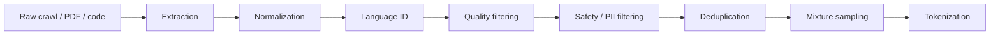

# Lecture 14: Data Filtering and Post Training Data

> 课程来源：`context/14 - Lecture 14  Data  重制版.json`
>
> 本讲继续数据主题，重点是从原始数据到训练数据的过滤 pipeline，以及 post-training data 的基本形态。

## 0. 本讲学习目标

- 理解 data filtering 的目标和方法。
- 区分 heuristic filtering 与 classifier-based filtering。
- 理解 toxicity、PII、spam、boilerplate、language ID 等过滤任务。
- 理解 MinHash/LSH 近重复去重的直觉。
- 认识 post-training data 与 pretraining data 的差异。

## 1. Data filtering 的目标

过滤不是简单地删掉“坏词”，而是定义什么数据值得花 compute 学习。

目标包括：

- 提高平均质量；
- 删除垃圾和模板；
- 控制有害内容；
- 删除隐私信息；
- 提升多样性；
- 减少重复；
- 降低污染；
- 匹配目标能力。

## 2. 原始数据处理 pipeline

典型流程：



每一步都有阈值和取舍。过度过滤会降低覆盖和多样性；过滤不足会浪费训练预算。

## 3. Heuristic filtering

Heuristic rules 是手写规则，例如：

- 文档长度范围；
- 平均词长；
- 字符重复率；
- 非字母字符比例；
- HTML 标签残留；
- 乱码比例；
- stopword 比例；
- 行重复比例。

优点：

- 快；
- 可解释；
- 易部署。

缺点：

- 粗糙；
- 易误删边缘领域；
- 规则需要人工维护。

## 4. Classifier-based filtering

训练一个轻量 classifier 判断文档质量或类别。例如用人工标注的 high-quality / low-quality 数据训练模型。

常见用途：

- 判断网页是否像 Wikipedia/书籍；
- 判断是否 spam；
- 判断是否 toxic；
- 判断是否包含成人或暴力内容；
- 判断语言种类。

优点是更灵活；缺点是 classifier 偏差会进入训练集，并且阈值选择很经验化。

## 5. Language identification

Language ID 判断文档语言。它影响：

- 多语言 mixture；
- 非目标语言过滤；
- tokenizer 分布；
- benchmark 能力。

难点：

- 短文本；
- code-mixed 文本；
- 方言；
- transliteration；
- HTML boilerplate 干扰。

## 6. PII 与隐私过滤

PII 包括姓名、地址、电话、邮箱、身份证号、密钥等可识别个人或敏感资源的信息。

过滤方法：

- 正则表达式；
- NER 模型；
- secret scanners；
- rule + classifier；
- hash/blocklist。

风险是 precision-recall trade-off：漏删会带来隐私风险，误删会损失正常数据。

## 7. Toxicity 与 safety filtering

Toxicity filtering 用于减少有害、仇恨、骚扰或极端内容。但不能简单删除所有敏感文本，因为安全模型也需要学习如何识别和拒绝有害请求。

策略可能包括：

- pretraining 中降低比例；
- safety 数据单独保留用于 post-training；
- 按领域和语境区分；
- 对高风险内容做访问控制。

## 8. Deduplication 与 MinHash/LSH

Near dedup 常用 MinHash 和 LSH 近似查找相似文档。

直觉：

- 把文档转成 shingles，例如连续 n-grams。
- 用 MinHash 估计 Jaccard similarity。
- 用 LSH 把相似文档放到同一 bucket。
- 在 bucket 内删除近重复。

这种方法可在大规模语料上近似检测相似文档，而不用两两比较。

## 9. Post-training data

Post-training data 与 pretraining data 不同。它通常更小、更结构化、更贴近模型行为目标。

类型：

- instruction data；
- dialogue data；
- preference pairs；
- safety demonstrations；
- reasoning traces；
- tool-use trajectories；
- human-written or synthetic responses。

目标不是学习世界所有文本分布，而是塑造模型行为。

## 10. 数据工作的迭代性

数据 pipeline 很难一次写对。常见迭代闭环：

```text
build dataset -> train/evaluate model -> inspect failures -> update filters/mixture -> retrain
```

高质量数据工作依赖大量具体样本检查。抽象指标有用，但不能替代人工 inspection。

## 11. 本讲关键术语

- Data filtering: 选择训练数据的过程。
- Heuristic filter: 手写规则过滤器。
- Quality classifier: 判断文档质量的模型。
- Language ID: 语言识别。
- PII filtering: 隐私信息过滤。
- Toxicity filtering: 有害内容过滤。
- Boilerplate: 网页模板、导航、广告等非正文内容。
- MinHash: 估计集合相似度的哈希方法。
- LSH: locality-sensitive hashing。
- Post-training data: 用于对齐、指令和偏好学习的数据。

## 12. 易错点

- 不要把过滤理解成越严格越好。过严会损失覆盖和多样性。
- 不要只依赖 classifier 分数。要人工检查边界样本。
- 不要把 toxic content 全部删除后还期待模型学会安全拒答。
- 不要忽略短文本和多语言对 language ID 的挑战。
- 不要把 dedup 放在小规模问题看待，web 重复非常严重。

## 13. 自测题

1. Data filtering 的核心目标是什么？
2. Heuristic filtering 有什么优缺点？
3. Classifier-based filtering 的风险是什么？
4. Language ID 为什么重要？
5. PII filtering 的 precision-recall trade-off 是什么？
6. 为什么不能简单删除所有 toxic data？
7. MinHash 用于解决什么问题？
8. LSH 的直觉是什么？
9. Post-training data 和 pretraining data 有何不同？
10. 为什么数据 pipeline 需要迭代？

## 14. 自测题答案

1. 在固定 compute 下选择更值得学习的数据，提高质量、降低风险、减少重复和污染。
2. 优点是快、可解释、易部署；缺点是粗糙、易误删，需要人工维护。
3. 分类器偏差会传递到数据集，阈值选择经验化，且可能误删高价值边缘数据。
4. 它决定多语言 mixture、目标语言覆盖和过滤策略，错误识别会扭曲数据分布。
5. 高 recall 能减少漏删隐私但误删更多正常文本；高 precision 误删少但可能漏掉敏感信息。
6. 模型需要学习识别和拒绝有害请求；完全删除可能削弱安全判断能力，也可能损失新闻、法律、医学等正常语境。
7. 在大规模语料中高效估计文档相似度，用于 near dedup。
8. 相似对象更可能被哈希到同一 bucket，从而避免全量两两比较。
9. Pretraining data 大而泛，用于学习语言和知识；post-training data 小而结构化，用于塑造指令、偏好、安全和推理行为。
10. 过滤规则和 mixture 的好坏需要通过训练结果、评估和样本 inspection 反馈不断修正。
