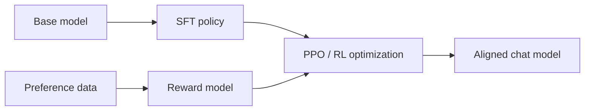

# Lecture 15: Post Training SFT RLHF and DPO

> 课程来源：`context/15 - Lecture 15  Mid Post-Training 重制版.json`
>
> 本讲从 pretraining 进入 post-training，讨论如何把 base model 转换为 instruction-following/chat model，重点包括 SFT、preference data、reward model、RLHF、PPO 和 DPO。

## 0. 本讲学习目标

- 区分 base model、instruction-tuned model 和 chat model。
- 理解 SFT 的数据格式和训练目标。
- 理解 preference data 和 reward model。
- 理解 RLHF 的三阶段流程。
- 理解 PPO 在语言模型中的基本角色。
- 理解 DPO 为什么可以绕过显式 reward model。
- 理解 over-optimization / reward hacking。

## 1. 为什么需要 post-training

Pretraining 学到的是互联网文本分布。Base model 擅长补全文本，但不一定：

- 遵循用户指令；
- 使用对话格式；
- 拒绝危险请求；
- 给出简洁答案；
- 调用工具；
- 按人类偏好组织回答。

Post-training 的目标是把语言建模能力塑造成可用助手行为。

## 2. Base model、instruct model、chat model

- Base model: 只经过大规模 next-token pretraining。
- Instruct model: 经过 instruction-response 数据微调，能遵循任务指令。
- Chat model: 进一步适配多轮对话、角色模板、安全策略和人类偏好。

差异不是架构，而是训练数据和目标。

## 3. SFT / Supervised Fine-Tuning

SFT 使用 prompt-response pairs：

```text
prompt: "解释 BPE"
response: "BPE 是一种..."
```

训练目标仍是 next-token loss，但通常只在 response 部分计算 loss，避免模型学习预测用户 prompt。

SFT 数据来源：

- 人工撰写；
-专家示范；
- 从现有模型蒸馏；
- synthetic instruction data；
- 多轮对话数据。

## 4. Chat template

Chat model 输入不是裸文本，而是结构化 conversation：

```text
<system>...</system>
<user>...</user>
<assistant>...</assistant>
```

Chat template 决定 role、turn boundary 和特殊 tokens。训练和推理必须一致，否则模型看到的格式会偏离训练分布。

## 5. Preference data

Preference data 通常是三元组：

```text
prompt
chosen response
rejected response
```

它表达“在同一 prompt 下，人类更偏好 chosen”。偏好可能来自 helpfulness、truthfulness、safety、style、format 等综合判断。

## 6. Reward model

Reward model 输入 prompt 和 response，输出一个标量 reward：

```text
r = R(prompt, response)
```

用 preference pairs 训练时，目标是让 chosen 的 reward 高于 rejected：

```text
R(chosen) > R(rejected)
```

Reward model 把人类偏好转成可优化信号。

## 7. RLHF 流程

经典 RLHF：

1. SFT：训练初始 policy。
2. Reward modeling：用 preference data 训练 reward model。
3. RL optimization：用 PPO 等方法优化 policy，使 reward 更高，同时用 KL penalty 约束不要偏离 SFT model 太远。

示意图：



## 8. PPO 与 KL penalty

PPO 是 policy gradient 方法。语言模型中，policy 是生成 token 的分布。

优化目标大致包含：

- reward model 给出的 reward；
- KL penalty，限制新 policy 不要远离 reference policy；
- value function 或 advantage estimation。

KL penalty 很重要，因为 reward model 不完美。若无限优化 reward，模型可能找到 reward model 漏洞。

## 9. DPO

DPO / Direct Preference Optimization 直接用 preference pairs 优化 policy，不显式训练 reward model，也不运行在线 RL。

直觉：

```text
increase probability of chosen response
decrease probability of rejected response
relative to reference model
```

优点：

- 实现简单；
- 训练稳定；
- 不需要 PPO rollout；
- 常用于 preference tuning。

限制：

- 依赖离线 preference data；
- 不等同于所有 RLHF 场景；
- 对数据质量敏感。

## 10. Reward hacking 与 over-optimization

Reward model 是人类偏好的近似。过度优化可能导致：

- 答案变长但不更好；
- 迎合评分器；
- 格式投机；
- hallucination 更自信；
- 安全策略异常；
- reward 上升但真实人类偏好下降。

因此 post-training 需要持续 evaluation，而不是只看 reward。

## 11. 本讲关键术语

- Post-training: 预训练后塑造模型行为的训练阶段。
- SFT: supervised fine-tuning。
- Instruction tuning: 用指令数据训练模型遵循任务。
- Chat template: 对话格式协议。
- Preference data: chosen/rejected 偏好对。
- Reward model: 预测人类偏好的模型。
- RLHF: reinforcement learning from human feedback。
- PPO: proximal policy optimization。
- KL penalty: 约束 policy 偏离 reference model。
- DPO: direct preference optimization。
- Reward hacking: 利用奖励模型漏洞。

## 12. 易错点

- 不要把 SFT 当成新损失函数，本质仍是 next-token loss。
- 不要忽略 chat template，一致性非常关键。
- 不要把 reward model 分数当成真实质量。
- 不要认为 DPO 完全替代所有 RLHF。
- 不要只优化 helpfulness 而忽略 safety。

## 13. 自测题

1. Base model 为什么不一定是好助手？
2. SFT 训练目标是什么？
3. 为什么 response 部分常常才计算 loss？
4. Preference data 的基本格式是什么？
5. Reward model 学什么？
6. RLHF 的三阶段是什么？
7. PPO 中 KL penalty 的作用是什么？
8. DPO 相比 RLHF/PPO 简化了什么？
9. Reward hacking 是什么？
10. 为什么 post-training 需要多维 evaluation？

## 14. 自测题答案

1. Base model 学的是文本补全分布，不保证遵循指令、对话格式、安全拒答或人类偏好。
2. 在 prompt-response 数据上继续做 next-token prediction，使模型学会生成期望回答。
3. 因为用户 prompt 是条件输入，目标是训练模型回答，而不是让模型学习生成用户问题。
4. 同一 prompt 下的 chosen response 和 rejected response。
5. 它学习给 prompt-response pair 打分，使人类偏好的回答得分更高。
6. SFT、reward model training、用 PPO 等 RL 方法优化 policy。
7. 防止 policy 为追求 reward 过度偏离 reference/SFT model，降低 reward hacking 和语言退化风险。
8. 它不显式训练 reward model，也不需要在线 PPO rollout，而是直接用 preference pairs 优化 policy。
9. 模型利用 reward model 的缺陷获得高分，但真实质量或人类偏好并未提升。
10. 因为 helpfulness、truthfulness、safety、style、reasoning 可能相互冲突，单一 reward 或 benchmark 不充分。
