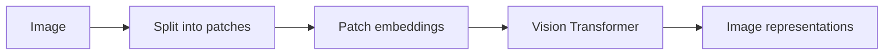
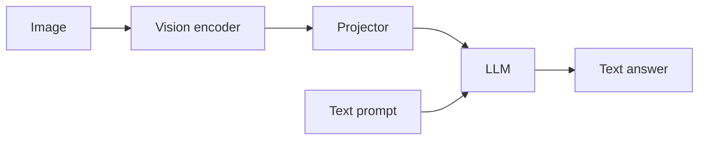

# Lecture 17: Multimodality

> 课程来源：`context/17 - Lecture 17  Alignment - Multimodality 重制版.json`
>
> 本讲从 text-only language model 扩展到 multimodal model，重点是如何把图像等非文本信息接入 Transformer。

## 0. 本讲学习目标

- 理解 multimodal model 的基本目标。
- 理解 image patch、vision encoder、projection adapter 和 language model 的组合。
- 理解 CLIP 的对比学习目标。
- 理解 ViT、LLaVA 类模型的结构。
- 理解图像 token、连续 embedding、OCR 和 image-text alignment。

## 1. 为什么需要多模态

现实任务不只包含文本：

- 图片问答；
- 图表理解；
- OCR；
- 屏幕操作；
- 视频理解；
- 医学影像；
- 机器人感知；
- 图像生成。

Multimodal model 的目标是把非文本信号转换成 language model 可处理的 representation，并在统一接口中推理和生成。

## 2. 图像表示：patches

Vision Transformer 把图像切成 patches。例如 `224x224` 图像，patch size `16x16`，会得到：

```text
(224 / 16)^2 = 196 patches
```

每个 patch 被展平并投影成向量，类似文本 token embedding。



## 3. Vision Transformer / ViT

ViT 把图像 patch 当作序列，用 Transformer 编码。

与文本 Transformer 类似：

- patch embeddings；
- position embeddings；
- self-attention；
- MLP；
- normalization。

差别在于输入 token 来自图像 patch，而不是 tokenizer。

## 4. CLIP

CLIP 通过 image-text contrastive learning 对齐图像和文本。

训练数据是图像和文本 caption 对。模型包括：

- image encoder；
- text encoder；
- contrastive loss。

目标是让匹配的 image-text pair 表示相近，不匹配的 pair 表示远离。

结果是得到一个强大的视觉语义 encoder，可作为 multimodal LLM 的前端。

## 5. Multimodal projection / adapter

Language model 接受的是 hidden vectors。Vision encoder 输出的 image features 需要通过 projector 映射到 LLM hidden size。

常见结构：

```text
image -> vision encoder -> image features -> projector -> LLM token-like embeddings
```

Projector 可以是：

- linear layer；
- MLP；
- cross-attention adapter；
- Q-former 类模块。

## 6. LLaVA 类模型

LLaVA 类模型的基本结构：



训练通常包括：

- image-text alignment pretraining；
- visual instruction tuning；
- 多轮图文对话数据。

模型输出仍是文本，但条件输入包含图像表示。

## 7. 图像 tokens 与文本 tokens 的融合

融合方式：

- prepend image tokens 到文本前；
- 在 prompt 中用 special token 标记图像位置；
- cross-attention 让文本查询图像 features；
- interleaved image-text sequences。

关键要求：

- LLM 能识别哪些 embedding 来自图像；
- position 和 modality boundary 清晰；
- 训练数据覆盖目标任务。

## 8. OCR 与视觉语言能力

OCR 是多模态模型的重要能力，因为许多图像包含文字，如截图、文档、图表。

挑战：

- 小字；
- 旋转；
- 表格结构；
- 复杂版面；
- 多语言；
- 手写体。

OCR 需要高分辨率视觉输入和细粒度定位能力，不只是图像语义分类。

## 9. 图像生成与 diffusion

本讲也提到生成方向。Diffusion model 是图像生成主流方法之一，通过逐步去噪生成图像。

与 multimodal understanding 不同：

- understanding: image -> text/reasoning；
- generation: text/condition -> image。

现代系统常把 LLM 与 diffusion model、image tokenizer 或视觉 encoder 组合。

## 10. 离散 token 与连续 embedding

多模态有两种表示路线：

- 把图像离散化成 tokens；
- 使用连续 vision encoder embeddings。

离散 token 便于统一序列建模；连续 embedding 通常保留更丰富视觉信息。当前许多视觉语言模型更偏向连续 encoder + projector。

## 11. 本讲关键术语

- Multimodal model: 处理多种模态的模型。
- Patch: 图像切分出的局部块。
- ViT: vision transformer。
- CLIP: 对齐图像和文本表示的对比学习模型。
- Contrastive learning: 拉近正样本、推远负样本的训练方法。
- Vision encoder: 把图像转成特征表示的模型。
- Projector / adapter: 把视觉特征映射到 LLM hidden space。
- LLaVA: vision encoder + projector + LLM 的视觉指令模型范式。
- OCR: optical character recognition。
- Diffusion model: 逐步去噪生成模型。

## 12. 易错点

- 不要认为多模态只是把图片转成 caption。模型需要细粒度视觉 grounding。
- 不要忽略 projector。视觉 encoder 和 LLM hidden space 不天然兼容。
- 不要把 CLIP 当成完整对话模型。它主要提供 image-text alignment。
- 不要认为高层语义理解等于 OCR 能力。
- 不要混淆图像理解和图像生成。

## 13. 自测题

1. Multimodal model 要解决什么问题？
2. ViT 如何把图像转成序列？
3. CLIP 的训练目标是什么？
4. Projector 为什么必要？
5. LLaVA 类模型由哪些部分组成？
6. 图像 tokens 如何与文本 tokens 融合？
7. OCR 为什么是特殊挑战？
8. Diffusion model 主要用于什么？
9. 离散图像 token 和连续 embedding 有何取舍？
10. 为什么多模态评估困难？

## 14. 自测题答案

1. 让模型能同时理解和生成涉及文本、图像等多种信号的任务。
2. 把图像切成固定大小 patches，每个 patch 投影成向量，再输入 Transformer。
3. 让匹配的图像和文本表示相近，不匹配的表示远离。
4. Vision encoder 输出维度和分布与 LLM hidden space 不一致，需要映射适配。
5. 通常包括 vision encoder、projector/adaptor、LLM 和图文 instruction tuning 数据。
6. 可以把图像 embeddings 作为特殊 token 序列插入 prompt，或用 cross-attention 连接视觉特征。
7. 它要求识别细粒度文字、版面和位置，而不仅是图像整体语义。
8. 主要用于图像生成，通过从噪声逐步去噪生成符合条件的图像。
9. 离散 token 便于统一语言建模，但可能损失细节；连续 embedding 保留信息更丰富，但与 LLM 融合需适配。
10. 因为任务跨度大，包括语义、定位、OCR、推理、安全和生成质量，单一指标难以覆盖。
