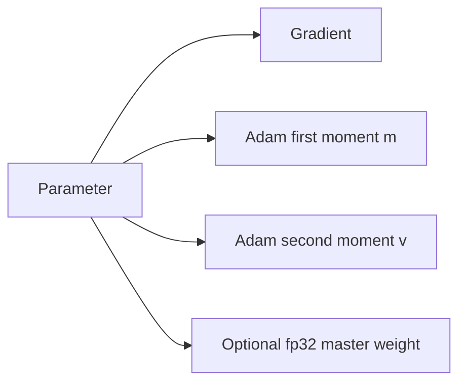
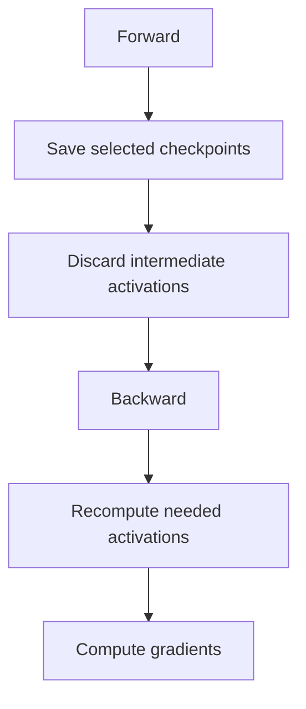

# Lecture 2: PyTorch, Einops and Resource Accounting

> 课程来源：`context/02 - Lecture 2  PyTorch(einops) 重制版.json`
>
> 本讲从“能写出 Transformer”推进到“能估算 Transformer 的计算与内存成本”。重点是张量形状、PyTorch 表达、FLOPs、memory 和 roofline analysis。

## 0. 本讲学习目标

完成本讲后，应当能够：

- 用 batch、sequence length、hidden size、vocabulary size 描述语言模型中的主要张量。
- 理解 PyTorch 的 tensor、view、reshape、transpose、broadcasting 和 autograd。
- 使用 `einsum` / `einops` 表达矩阵乘法、attention 和维度重排。
- 估算 Transformer 训练中的 parameters、activations、gradients、optimizer states。
- 区分 FLOPs、FLOP/s、MFU、throughput 和 wall-clock time。
- 判断一个算子是 compute-bound 还是 memory-bound。
- 解释 gradient accumulation 和 activation checkpointing 为什么能缓解显存压力。

## 1. 为什么要做 resource accounting

语言模型不是只由数学公式决定，还受硬件资源约束。训练一个模型前，至少需要估算：

- 参数是否放得进 GPU memory。
- 前向和反向传播的 activations 是否放得下。
- optimizer states 会增加多少显存。
- 每个 batch 大约需要多少 FLOPs。
- 训练总 tokens 数和总 FLOPs 是否符合预算。
- 当前实现能达到硬件峰值性能的多少比例。

这类估算叫 resource accounting。它的作用不是给出完美精确值，而是在设计阶段排除明显不可行的配置，并定位优化方向。

## 2. 语言模型中的张量形状

常用符号：

- `B`: batch size
- `T`: sequence length / context length
- `D`: model dimension / hidden size
- `V`: vocabulary size
- `H`: number of attention heads
- `Dh`: head dimension，通常 `Dh = D / H`

一个 decoder-only language model 的输入通常是：

```text
input_ids: [B, T]
```

经过 embedding 后：

```text
x: [B, T, D]
```

输出 logits：

```text
logits: [B, T, V]
```

训练目标是 next-token prediction：位置 `t` 的 hidden state 预测位置 `t+1` 的 token。

## 3. PyTorch 的核心抽象

PyTorch 中的 `Tensor` 是多维数组，同时可以记录计算图以支持 autograd。

常见操作：

- `reshape` / `view`: 改变张量形状。`view` 通常要求底层 memory layout 连续。
- `transpose` / `permute`: 交换维度顺序，经常导致非 contiguous tensor。
- `contiguous`: 重新排布内存，使张量按当前形状连续存储。
- broadcasting: 在维度兼容时自动扩展张量。
- `matmul`: 根据输入维度自动执行向量、矩阵或 batch matrix multiplication。

教学重点：写深度学习代码时，许多 bug 不是来自公式错误，而是来自 shape 错误。应始终把 shape 当成类型系统的一部分。

## 4. `einsum` 与 `einops`

`einsum` 用符号下标表达张量运算。例如：

```text
out[b, t, o] = sum_i x[b, t, i] * W[i, o]
```

可写作：

```python
torch.einsum("bti,io->bto", x, W)
```

`einops` 更强调可读的维度重排，例如：

```python
rearrange(x, "b t (h d) -> b h t d", h=num_heads)
```

这在 attention 中非常常见：

```text
x: [B, T, D]
qkv: [B, T, 3D]
q, k, v: [B, H, T, Dh]
scores: [B, H, T, T]
out: [B, T, D]
```

## 5. Transformer 前向传播的主要成本

一个 Transformer block 大致包含：

- normalization
- QKV projection
- scaled dot-product attention
- output projection
- MLP / feed-forward network
- residual connections

简化估算中，线性层矩阵乘法占主要 FLOPs。若矩阵乘法为：

```text
[m, k] @ [k, n] -> [m, n]
```

乘加成本约为：

```text
2 * m * k * n FLOPs
```

对语言模型来说，`B*T` 常被合并成 token batch：

```text
[B*T, D] @ [D, 4D]
```

因此 MLP 层成本大致与 `B*T*D^2` 成正比。

## 6. 参数、梯度与 optimizer states

训练时显存不只存 parameters。以 AdamW 为例，通常需要：

- parameters
- gradients
- first moment `m`
- second moment `v`

如果使用 mixed precision，还可能有：

- fp16 / bf16 parameters
- fp32 master weights

粗略地说，AdamW 的 optimizer states 会让每个参数的训练内存成本远高于推理时只存权重的成本。



这就是为什么大模型训练不能只看参数量，还要看 optimizer memory。

## 7. Activations 与反向传播

反向传播需要用到前向传播中的中间值，因此训练时必须保存 activations。例如：

- 每层输入 hidden states
- attention scores 或 softmax 结果
- MLP 中间激活
- normalization 中间统计量

Activation memory 近似随以下量增长：

```text
num_layers * batch_size * sequence_length * hidden_size
```

长上下文和大 batch 会显著增加 activation memory。

## 8. Gradient accumulation

如果目标 global batch size 太大，单次无法放进显存，可以把它拆成多个 microbatches。

```text
global batch = microbatch size * accumulation steps
```

流程：

```text
for each microbatch:
    forward
    backward
    accumulate gradients
optimizer.step()
zero_grad()
```

优点：

- 降低单次 forward/backward 的 activation memory。
- 模拟更大的 batch size。

代价：

- 每个 optimizer step 需要更多 microsteps。
- wall-clock time 可能增加。
- batch norm 等依赖 batch 统计的组件需要额外注意，但 LLM 通常不用 batch norm。

## 9. Activation checkpointing

Activation checkpointing 的思想是：前向传播时不保存全部 activations，只保存少数 checkpoint；反向传播时重新计算缺失的中间值。



它的 trade-off：

- 节省 memory。
- 增加 compute。

在大模型训练中，compute 通常比显存更容易扩展，因此 checkpointing 是常用技术。

## 10. FLOPs、throughput 与 MFU

几个概念需要区分：

- FLOPs: 浮点运算次数。
- FLOP/s: 每秒浮点运算能力。
- tokens/s: 每秒处理多少 tokens。
- wall-clock time: 实际训练耗时。
- MFU / Model FLOPs Utilization: 实际模型 FLOP/s 与硬件理论峰值的比例。

如果模型每 token 需要 `C_token` FLOPs，训练了 `N_tokens`，总 FLOPs 约为：

```text
C_total = C_token * N_tokens
```

若实际训练时间为 `S` 秒，则实际吞吐为：

```text
actual FLOP/s = C_total / S
```

MFU 低通常说明存在 kernel inefficiency、memory bandwidth bottleneck、communication overhead 或 CPU/GPU pipeline 问题。

## 11. Arithmetic intensity 与 roofline analysis

Arithmetic intensity 定义为：

```text
arithmetic intensity = FLOPs / bytes moved
```

如果一个算子每读取很少数据就做大量计算，它更可能 compute-bound；如果每读写大量数据只做少量计算，它更可能 memory-bound。

Roofline model 的直觉：

```text
achievable performance = min(peak compute, memory bandwidth * arithmetic intensity)
```

矩阵乘法通常 arithmetic intensity 高，因此容易接近 compute-bound。Elementwise operations、normalization、小 batch 的操作通常更偏 memory-bound。

## 12. 本讲关键术语

- Tensor: 多维数组，是深度学习计算的基本数据结构。
- Autograd: 自动微分系统，记录计算图并执行反向传播。
- Broadcasting: 按维度规则自动扩展张量。
- `einsum`: 用索引记号表达张量收缩。
- `einops`: 用显式维度命名表达 reshape、rearrange、reduce。
- FLOPs: 浮点运算次数。
- MFU: 模型实际利用硬件理论 FLOPs 的比例。
- Activation: 前向传播中需要用于反向传播的中间值。
- Gradient accumulation: 多个 microbatch 累积梯度后再更新参数。
- Activation checkpointing: 用重计算换显存。
- Arithmetic intensity: 每移动一个 byte 做多少 FLOPs。
- Roofline analysis: 判断算子性能受算力还是内存带宽限制的方法。

## 13. 易错点

- 不要只看 parameters 判断训练显存。optimizer states 和 activations 往往更关键。
- 不要把 FLOPs 和实际速度等同。kernel、memory、communication 都会影响 wall-clock time。
- 不要忽略 tensor layout。`transpose` 后的 tensor 可能不是 contiguous。
- 不要认为 gradient accumulation 会减少总计算量。它主要减少单次显存需求。
- 不要认为 checkpointing 免费。它用额外 forward recomputation 换 memory。

## 14. 自测题

1. 为什么 AdamW 训练时每个参数需要额外显存？
2. `B*T` 为什么经常被合并成一个维度参与线性层计算？
3. `einsum("bti,io->bto", x, W)` 表示什么操作？
4. Gradient accumulation 改变的是 global batch size 还是 microbatch size？
5. Activation checkpointing 为什么能节省显存？
6. 什么样的算子更容易 memory-bound？
7. MFU 低可能有哪些原因？
8. 为什么 attention score `[B, H, T, T]` 在长上下文下危险？
9. `reshape` 和 `transpose` 的风险分别是什么？
10. Roofline analysis 的核心判断是什么？

## 15. 自测题答案

1. AdamW 不只保存参数，还保存梯度、first moment、second moment，并可能保存 fp32 master weights。这些状态用于稳定优化和混合精度训练，因此训练显存远高于推理显存。
2. 线性层对每个 token 独立应用同一个权重矩阵。把 `[B, T, D]` 看成 `[B*T, D]` 可以把所有 token 的线性变换合成一次大矩阵乘法，提高硬件利用率。
3. 它表示对最后一维做线性投影：输入 `x[b,t,i]` 与权重 `W[i,o]` 相乘并对 `i` 求和，得到输出 `out[b,t,o]`。
4. 它允许在较小 microbatch size 下累积多个 microbatch 的梯度，从而形成较大的 effective/global batch size。单次显存由 microbatch 决定。
5. 前向传播不保存所有中间 activations，只保存少数 checkpoint；反向传播时重新计算需要的中间值。因此减少了 activation memory，但增加了计算量。
6. Elementwise operation、normalization、小规模 reduction 等每读写大量数据只做少量 FLOPs 的算子更容易 memory-bound。
7. 可能原因包括 kernel 未优化、batch 太小、memory bandwidth 瓶颈、CPU dataloader 慢、GPU 间通信开销、同步过多、shape 不适合 tensor cores。
8. 因为它随 `T^2` 增长。长上下文会让 attention matrix 的内存和计算迅速膨胀，这也是 FlashAttention 和 attention alternatives 的动机。
9. `reshape` 可能在非 contiguous 情况下触发复制或失败；`transpose` 会改变 stride，导致后续操作性能下降或要求调用 `contiguous`。
10. 它比较算子的 arithmetic intensity 与硬件的 compute peak、memory bandwidth，判断性能上限主要由算力还是数据搬运决定。
