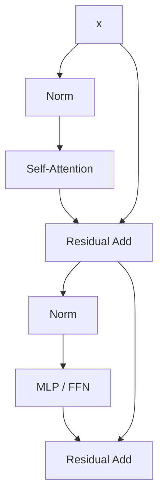

# Lecture 3: Transformer Architectures

> 课程来源：`context/03 - Lecture 3  Architectures 重制版.json`
>
> 本讲讨论现代 decoder-only Transformer 的组成、超参数和常见架构变体。重点不是背模型名，而是理解每个设计选择改变了什么。

## 0. 本讲学习目标

- 描述 decoder-only Transformer block 的数据流。
- 理解 residual stream、normalization、attention、MLP 的角色。
- 区分 pre-norm 与 post-norm。
- 解释 RMSNorm、SwiGLU、RoPE、GQA 等现代默认选择。
- 理解 depth、width、heads、context length 等 hyperparameters 的影响。
- 从训练稳定性、表达能力和硬件效率三个角度评价 architecture。

## 1. Decoder-only Transformer 总览

现代 language model 多数采用 decoder-only Transformer。给定 token ids：

```text
tokens -> embeddings -> repeated Transformer blocks -> logits
```

一个 block 的常见结构：



核心思想是 residual stream：模型维护一个 `[B, T, D]` 的向量流，每个子层读取它、写入一个增量，再通过 residual connection 加回去。

## 2. Embedding 与 logits

输入 token ids 通过 embedding table 转成向量：

```text
E: [V, D]
input_ids: [B, T]
x: [B, T, D]
```

输出层把 hidden state 投影回 vocabulary：

```text
logits = x @ W_out
logits: [B, T, V]
```

许多模型使用 tied embeddings，即输入 embedding 和输出 projection 共享权重。这可以减少参数，也可能改善 token 表示的一致性。

## 3. Self-attention

Self-attention 让每个位置从之前位置读取信息。对 decoder-only LM 来说，使用 causal mask，位置 `t` 只能看见 `<= t` 的 token。

计算流程：

```text
Q = X W_Q
K = X W_K
V = X W_V
scores = Q K^T / sqrt(d_head)
weights = softmax(mask(scores))
output = weights V
```

注意：

- `Q` 表示当前位置想查询什么。
- `K` 表示每个历史位置提供什么索引。
- `V` 表示被读取的内容。
- causal mask 保证 next-token prediction 不偷看未来。

## 4. Multi-head attention

Multi-head attention 把 hidden dimension 分成多个 heads：

```text
[B, T, D] -> [B, H, T, Dh]
```

每个 head 可以学习不同的匹配模式，例如：

- 局部邻近依赖；
- 长距离复制；
- 语法结构；
- 分隔符或格式边界；
- induction heads 等序列模式。

最后把所有 heads 拼接并经过 output projection。head 数不是越多越好：太多 heads 会让每个 head 的 `Dh` 变小，影响表达和硬件效率。

## 5. MLP / Feed-forward network

Transformer block 中的 MLP 通常是逐 token 的非线性变换：

```text
MLP(x) = W_2 activation(W_1 x)
```

经典 expansion ratio 是 `4D`，即：

```text
D -> 4D -> D
```

现代 LLM 常用 gated MLP，例如 SwiGLU：

```text
SwiGLU(x) = (swish(x W_gate) * x W_up) W_down
```

直觉：gating 机制允许模型动态控制哪些 feature 通过，通常比普通 GELU MLP 更有效。

## 6. Normalization

Normalization 的作用是稳定训练，控制激活尺度。

LayerNorm 对每个 token 的 hidden dimension 做归一化。RMSNorm 去掉均值中心化，只按 root mean square 归一化：

```text
RMSNorm(x) = x / rms(x) * scale
```

RMSNorm 的优势：

- 计算略简单；
- 在 LLM 中表现稳定；
- 已成为许多现代模型默认选择。

## 7. Pre-norm 与 post-norm

Post-norm 原始形式：

```text
x = Norm(x + Sublayer(x))
```

Pre-norm 常见形式：

```text
x = x + Sublayer(Norm(x))
```

现代大模型多用 pre-norm，因为梯度可以更直接地沿 residual stream 传播，深层训练更稳定。post-norm 在较深网络中更容易出现训练不稳定，需要额外技巧。

## 8. Position information 与 RoPE

Self-attention 本身对 token 顺序不敏感，因此需要位置编码。

常见方法：

- absolute positional embeddings；
- learned positional embeddings；
- sinusoidal positional embeddings；
- RoPE / rotary positional embedding；
- ALiBi 等 attention bias 方法。

RoPE 的思想是在 Q/K 向量上施加与位置相关的旋转，使相对位置信息进入 dot product。它的优势是：

- 自然注入相对位置信息；
- 与 attention 结构兼容；
- 在长上下文外推中常比 learned absolute embedding 更稳健。

## 9. Attention variants in architecture

现代 LLM 在 attention 内部也有多个选择：

- MHA: 每个 head 有独立 K/V。
- MQA: 多个 query heads 共享一组 K/V。
- GQA: query heads 分组共享 K/V。

GQA 的动机主要来自 inference。KV cache 的大小与 K/V heads 数有关，减少 K/V heads 可以显著降低推理内存带宽压力，同时保留较多 query heads 的表达能力。

## 10. Hyperparameters

主要 architecture hyperparameters：

- number of layers `L`
- hidden size `D`
- number of heads `H`
- head dimension `Dh`
- MLP expansion ratio
- vocabulary size `V`
- context length `T`
- normalization 类型
- activation 类型
- positional encoding 类型

这些选择共同决定：

- 参数量；
- 每 token FLOPs；
- activation memory；
- attention memory；
- inference KV cache；
- 训练稳定性；
- scaling behavior。

## 11. Architecture 与 hardware

好的 architecture 不只是 loss 低，还要适合硬件：

- 大矩阵乘法更容易利用 tensor cores。
- 过小的 head dimension 或奇怪 shape 会降低效率。
- GQA/MQA 能降低 KV cache memory bandwidth。
- MoE 增加参数但引入 routing 和通信成本。
- 长上下文提升能力但增加 attention 和 KV cache 成本。

因此现代架构设计常常是 modeling quality 与 systems efficiency 的共同优化。

## 12. 本讲关键术语

- Decoder-only Transformer: 仅使用因果 self-attention 的生成式 Transformer。
- Residual stream: 贯穿网络层的 hidden state 主通道。
- Causal mask: 防止当前位置看到未来 tokens 的 mask。
- Multi-head attention: 多组 Q/K/V 并行注意力。
- MLP / FFN: 对每个 token 独立应用的非线性变换。
- SwiGLU: 带 gating 的 MLP activation。
- RMSNorm: 基于均方根的归一化方法。
- Pre-norm: 在子层前做 normalization。
- RoPE: rotary positional embedding。
- GQA: grouped-query attention。
- Hyperparameter: 架构或训练前设定的配置量。

## 13. 易错点

- 不要把 Transformer block 理解成只有 attention。MLP 通常占大量参数和计算。
- 不要忽略 residual connection。深层模型的可训练性高度依赖 residual stream。
- 不要认为位置编码只是小细节。它影响长上下文和外推。
- 不要把 head 数当作单独指标，必须同时看 `D` 和 `Dh`。
- 不要认为更复杂架构必然更好，硬件效率和训练稳定性同样重要。

## 14. 自测题

1. Decoder-only Transformer 为什么需要 causal mask？
2. Residual stream 在深层 Transformer 中有什么作用？
3. Pre-norm 相比 post-norm 为什么更适合深层 LLM？
4. MLP 在 Transformer 中承担什么功能？
5. SwiGLU 相比普通 MLP 多了什么机制？
6. RoPE 为什么作用在 Q/K 上？
7. GQA 为什么能改善 inference？
8. 为什么 architecture hyperparameters 会影响 scaling laws？
9. tied embeddings 的含义是什么？
10. 为什么 head 数不是越多越好？

## 15. 自测题答案

1. 因为 next-token prediction 要求位置 `t` 只能使用当前位置及其之前的信息。没有 causal mask，模型会看到未来 token，训练目标会泄漏答案。
2. Residual stream 提供稳定的信息高速通道，每个子层只需学习对当前表示的增量修改，使梯度更容易跨层传播。
3. Pre-norm 让梯度可以沿 residual path 更直接传播，不必穿过每层 normalization 和 sublayer，因此深层网络更稳定。
4. MLP 对每个位置独立进行非线性特征变换，提供大量参数容量，常负责知识存储和复杂 feature mixing。
5. SwiGLU 引入 gate 分支，用一个激活后的门控向量调制另一个投影分支，使信息通过更具选择性。
6. Attention 权重由 `QK^T` 决定。把位置信息注入 Q/K 后，相对位置会影响 dot product，从而影响注意力分布。
7. GQA 让多个 query heads 共享较少的 K/V heads，减少 KV cache 大小和读取带宽，因此 decode 阶段更高效。
8. 因为 depth、width、heads、MLP ratio 等决定参数量、FLOPs、activation memory 和优化稳定性，进而影响 loss 随规模变化的规律。
9. 输入 embedding matrix 与输出 vocabulary projection 使用同一组权重。
10. 在固定 `D` 下，head 越多每个 head 的 `Dh` 越小，可能降低表达能力，也可能产生不适合硬件的矩阵形状。
