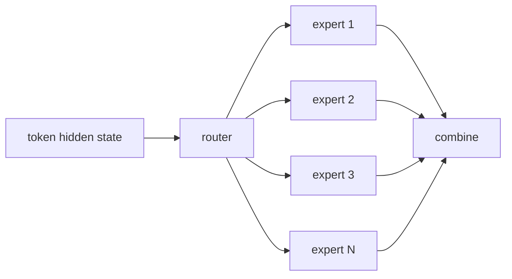

# Lecture 4: Attention Alternatives and Mixture of Experts

> 课程来源：`context/04 - Lecture 4  Attention Alternatives 重制版.json`
>
> 本讲讨论两类架构扩展：如何替代或改造 attention，以及如何用 Mixture of Experts 在不同比例上扩展参数量和计算量。

## 0. 本讲学习目标

- 理解标准 self-attention 的时间和内存瓶颈。
- 比较 sparse attention、linear attention、RNN/SSM/Mamba 类方法。
- 理解 MoE 的核心目标：增加 total parameters，同时限制 per-token compute。
- 解释 routing、top-k experts、capacity、load balancing 和 expert parallelism。
- 从 modeling、optimization、systems 三个角度分析 MoE 的利弊。

## 1. 标准 attention 的瓶颈

Self-attention 的核心计算是：

```text
scores = Q K^T
```

对于序列长度 `T`，attention matrix 是 `[T, T]`。因此：

- 计算复杂度大致是 `O(T^2 * D)`；
- attention scores 的中间存储是 `O(T^2)`；
- 推理时还需要维护 KV cache。

当 context length 从 4K 增加到 128K，attention 成本会快速成为主要问题。这推动了 attention alternatives。

## 2. Sparse attention

Sparse attention 不让每个 token attend to 所有历史 token，而是限制连接模式。

常见模式：

- local window attention：只看附近 token；
- strided attention：按固定间隔看远处 token；
- block sparse attention：以 block 为单位稀疏连接；
- global tokens：少数特殊 token 可被全局访问。

优点：

- 降低 `T^2` 成本；
- 适合长文档和局部结构强的数据。

缺点：

- 可能损失任意长距离依赖；
- 稀疏模式不一定适合 GPU；
- 很难为所有任务选一个固定 pattern。

## 3. Linear attention

Linear attention 尝试把 softmax attention 改写成可结合的形式：

```text
softmax(QK^T)V  ->  phi(Q) (phi(K)^T V)
```

如果能先聚合 `K,V`，复杂度可从 `O(T^2)` 降到 `O(T)`。

关键挑战：

- softmax attention 的表达能力很强，近似后可能损失性能；
- 数值稳定性和训练稳定性更复杂；
- 在大规模语言建模中要同时赢过标准 attention 的质量和硬件效率并不容易。

## 4. RNN、SSM 与 Mamba 类方法

RNN 类模型用递归 state 表示历史：

```text
h_t = f(h_{t-1}, x_t)
```

优点：

- 推理时每步只更新 state；
- 不需要随上下文长度线性增长的 KV cache；
- 理论上适合 streaming。

缺点：

- 训练并行性弱；
- 长距离信息压缩到固定 state 中；
- 过去 RNN 在大规模 LM 上被 Transformer 超越。

State Space Model / SSM 和 Mamba 类方法试图结合递归效率和并行训练。它们通常通过结构化状态更新、selective scan 等技术实现长序列建模。

## 5. Attention alternatives 的评价维度

评价一个 attention alternative 不能只看复杂度符号。需要同时考虑：

- quality：同等 compute 下 loss 是否更低？
- training stability：是否容易训练？
- hardware efficiency：是否能转化为快 kernel？
- memory behavior：activation 和 inference state 是否更小？
- long-context ability：是否真正保留远距离依赖？
- ecosystem cost：是否兼容现有 checkpoint、serving、tooling？

很多方法理论复杂度更低，但实际未必更快，因为 GPU 更擅长规则的大矩阵乘法。

## 6. Mixture of Experts 的问题设定

Dense Transformer 中，每个 token 都经过同一组 MLP 参数。MoE 的想法是准备多个 expert MLP，但每个 token 只激活其中少数几个。



MoE 的核心目标：

```text
increase total parameters
without proportionally increasing per-token FLOPs
```

这使模型拥有更大容量，但每个 token 的计算仍可控。

## 7. Router 与 top-k routing

Router 是一个小网络，给每个 token 分配 expert。

常见形式：

```text
router_logits = x W_router
router_probs = softmax(router_logits)
select top-k experts
```

如果 `k=1`，每个 token 只进一个 expert；如果 `k=2`，每个 token 进两个 experts，输出按 router weights 加权合并。

routing 的难点：

- experts 负载是否均衡；
- token 是否被路由到合适 expert；
- router 是否训练稳定；
- distributed setting 下 dispatch 是否高效。

## 8. Capacity 与 load balancing

每个 expert 在一个 batch 中能处理的 tokens 通常有限，称为 capacity。若太多 tokens 被路由到同一个 expert，可能出现 overflow。

为避免 collapse，需要 load balancing loss 或 routing 约束，使 tokens 更均匀地分配到 experts。

典型问题：

- 如果没有约束，router 可能只使用少数 experts。
- 如果强行均匀，可能牺牲语义 specialization。
- 容量过小会丢 token 或退化，容量过大又浪费内存。

## 9. Expert parallelism

MoE 在多 GPU 上通常把不同 experts 放在不同设备。token 需要根据 routing 结果跨设备发送。

这会引入 all-to-all communication：

```text
tokens -> dispatch to expert GPUs -> expert compute -> gather outputs
```

因此 MoE 的 systems 成本很高。它的瓶颈不只是 FLOPs，还包括：

- token dispatch；
- all-to-all bandwidth；
- load imbalance；
- small matrix multiplication efficiency；
- expert placement。

## 10. MoE 的优势与风险

优势：

- 在固定 per-token compute 下增加模型容量。
- 允许不同 experts 学习不同数据模式。
- 在大规模训练中 compute-efficient。

风险：

- routing 不稳定；
- 负载不均衡；
- 分布式通信复杂；
- fine-tuning 和 serving 更复杂；
- 小规模实验不一定体现大规模收益。

## 11. 本讲关键术语

- Quadratic attention: 随序列长度平方增长的标准 attention 成本。
- Sparse attention: 只计算部分 token 对之间的 attention。
- Linear attention: 试图用核技巧或特征映射把 attention 降为线性复杂度。
- RNN: 通过递归 hidden state 建模序列。
- SSM: state space model，用状态空间方程建模序列。
- Mamba: selective state space 思路的代表模型族。
- MoE: mixture of experts。
- Expert: MoE 中被 router 选择的子网络，通常是 MLP。
- Router: 决定 token 分配到哪些 experts 的模块。
- Top-k routing: 选择概率最高的 k 个 experts。
- Load balancing: 让 experts 使用更均匀的训练约束。
- All-to-all: 多设备间每个设备向所有设备发送数据的 collective。

## 12. 易错点

- 不要只看理论复杂度。硬件效率可能抵消复杂度优势。
- 不要认为 MoE 每次使用所有参数。每个 token 只激活少数 experts。
- 不要把 total parameters 和 active parameters 混淆。
- 不要忽略 MoE 通信成本。all-to-all 可能成为瓶颈。
- 不要认为 expert specialization 自动发生，routing 和负载平衡会强烈影响它。

## 13. 自测题

1. 标准 attention 为什么是长上下文瓶颈？
2. Sparse attention 的主要风险是什么？
3. Linear attention 想解决什么问题？
4. RNN/SSM 类方法在 inference 上有什么潜在优势？
5. MoE 为什么能增加参数量但不等比例增加每 token 计算？
6. Router 的输出用于做什么？
7. Top-1 routing 和 top-2 routing 的差别是什么？
8. 为什么需要 load balancing loss？
9. MoE 中 all-to-all communication 发生在哪里？
10. total parameters 和 active parameters 有什么区别？

## 14. 自测题答案

1. 因为 attention matrix 是 `[T,T]`，计算和内存随序列长度平方增长；推理还要维护随上下文增长的 KV cache。
2. 固定稀疏模式可能遗漏重要长距离依赖，并且稀疏计算不一定能在 GPU 上高效执行。
3. 它试图避免显式构造 `T*T` attention matrix，把复杂度降到线性或近线性。
4. 它们可以用固定或压缩 state 表示历史，decode 时不必读取整个 KV cache，因此长上下文推理可能更省内存。
5. 因为模型有很多 experts，但每个 token 只路由到少数 experts，计算只发生在被激活的子网络上。
6. Router 为每个 token 选择 expert，并给出组合权重或路由概率。
7. Top-1 每个 token 只进一个 expert，计算更少但表达和稳定性可能较弱；top-2 使用两个 experts，成本更高但组合更平滑。
8. 防止所有 token 集中到少数 experts，造成 expert collapse、容量溢出和设备负载不均。
9. token 根据 routing 结果从原设备发送到持有目标 expert 的设备，expert 计算后再把输出发送回来。
10. total parameters 是模型所有 experts 和共享层的总参数；active parameters 是单个 token 前向时实际使用的参数。
