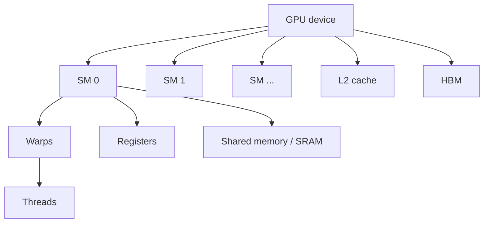

# Lecture 5: GPUs, TPUs and Hardware Fundamentals

> 课程来源：`context/05 - Lecture 5  GPUs, TPUs 重制版.json`
>
> 本讲进入系统部分，目标是理解为什么现代语言模型训练依赖 GPU/TPU，以及硬件结构如何决定算法实现方式。

## 0. 本讲学习目标

- 理解 GPU 为什么适合深度学习。
- 描述 SM、warp、thread、register、shared memory、HBM 的层次结构。
- 解释 tensor cores 和低精度计算的作用。
- 区分 compute throughput 与 memory bandwidth。
- 理解 TPU 的 systolic array 思路。
- 用 hardware-aware 视角解释 FlashAttention 等优化。

## 1. 为什么深度学习需要专用硬件

Transformer 训练的大部分 FLOPs 来自矩阵乘法：

```text
[B*T, D] @ [D, 4D]
```

矩阵乘法有两个特点：

- 数据并行性强：许多输出元素可独立计算。
- 计算密度高：读入一块矩阵数据后可复用多次。

GPU/TPU 正是为大规模并行和矩阵乘法优化的硬件。

## 2. GPU 层次结构

简化结构：



主要组件：

- SM / Streaming Multiprocessor：GPU 的主要计算单元。
- Warp：一组通常 32 个 threads，以 SIMT 方式执行。
- Thread：执行单个 lane 的程序实例。
- Registers：每个 thread 私有，最快但容量小。
- Shared memory：同一 block 内 threads 共享，速度快。
- HBM：高带宽显存，容量大但比 SRAM 慢。

## 3. SIMT 执行模型

GPU 使用 SIMT / single instruction, multiple threads。一个 warp 中的 threads 同时执行同一条指令，但处理不同数据。

适合 GPU 的代码通常具有：

- 大量独立 work items；
- 规则内存访问；
- 少分支或分支一致；
- 高 arithmetic intensity。

不适合 GPU 的代码通常有：

- 串行依赖；
- 随机内存访问；
- 小规模任务；
- 频繁 CPU-GPU 同步。

## 4. Memory hierarchy

硬件性能的核心矛盾：计算越来越快，数据移动仍然昂贵。

从快到慢大致是：

```text
registers -> shared memory / SRAM -> L2 cache -> HBM -> CPU memory
```

优化目标不是“少做计算”那么简单，而是：

- 尽量复用已读入的数据；
- 减少 HBM 往返；
- 合并连续内存访问；
- 避免不必要的中间张量写回。

## 5. Tensor cores 与低精度

现代 NVIDIA GPU 有 tensor cores，专门加速矩阵乘法。它们通常支持：

- FP32
- TF32
- FP16
- BF16
- FP8 或更低精度格式

训练 LLM 常用 BF16/FP16，因为：

- 计算吞吐更高；
- 显存占用更小；
- tensor cores 利用率更高。

但低精度也带来数值稳定性问题，因此许多系统保留 fp32 accumulation、loss scaling 或 fp32 optimizer states。

## 6. Compute throughput 与 memory bandwidth

硬件有两个关键峰值：

- peak FLOP/s：理论最大计算速度。
- memory bandwidth：每秒可从 HBM 读写多少 bytes。

如果算子需要大量数据移动但计算很少，就无法达到 peak FLOP/s。许多 elementwise op 正是如此。

矩阵乘法通常更容易利用计算峰值，因为每个读入元素可参与多次乘加。

## 7. FlashAttention 的硬件动机

标准 attention 可能显式生成 attention matrix：

```text
scores: [B, H, T, T]
```

这会造成大量 HBM 读写。FlashAttention 的核心思想是 IO-aware：分块计算 attention，在 SRAM 中保存局部块，避免把完整 attention matrix 写入 HBM。

简化理解：

```text
普通 attention: write large scores to HBM, read back, softmax, write again
FlashAttention: tile Q/K/V, compute softmax online, write final output
```

它不改变数学结果，主要改变数据移动方式。

## 8. TPU 的基本思想

TPU 是为机器学习矩阵运算设计的专用加速器。关键思想包括：

- systolic array：数据在矩阵乘法单元中有节奏地流动和复用；
- 大规模矩阵单元；
- 与 XLA 编译器紧密配合；
- pod 级别互联支持大规模训练。

GPU 更通用，生态成熟；TPU 更强调端到端编译和矩阵计算路径。课程中关心二者共同点：硬件结构决定 efficient implementation。

## 9. Hardware-aware architecture

架构设计必须考虑硬件：

- hidden size 是否适合 tensor cores；
- head dimension 是否对齐；
- activation 是否能 fusion；
- attention 是否产生巨大中间张量；
- MoE 是否引入昂贵 all-to-all；
- inference 是否受 KV cache bandwidth 限制。

一个理论上参数更少的模型，如果 shape 不适合硬件，实际可能更慢。

## 10. 本讲关键术语

- GPU: 大规模并行计算设备。
- SM: GPU 上的流式多处理器。
- Warp: 通常 32 个 threads 的执行单位。
- Register: 线程私有高速存储。
- Shared memory: block 内共享的高速 SRAM。
- HBM: GPU 高带宽显存。
- Tensor core: 专门加速矩阵乘法的硬件单元。
- BF16/FP16: 深度学习常用低精度格式。
- Memory bandwidth: 单位时间可移动的数据量。
- Arithmetic intensity: FLOPs 与数据移动 bytes 的比值。
- TPU: 面向 ML workload 的专用加速器。
- Systolic array: 数据在计算阵列中流动复用的结构。

## 11. 易错点

- 不要以为 GPU 快是因为单个 thread 快。GPU 强在大量并行。
- 不要忽略 memory bandwidth。许多算子不是算不动，而是数据搬不动。
- 不要以为减少 FLOPs 一定加速。如果破坏矩阵乘法结构，可能更慢。
- 不要把 HBM 和 shared memory 混淆。二者容量和速度差别巨大。
- 不要认为低精度只是省显存，它还关系到 tensor core 吞吐。

## 12. 自测题

1. 为什么矩阵乘法适合 GPU？
2. Warp 是什么？
3. Registers、shared memory、HBM 的区别是什么？
4. 为什么 elementwise op 容易 memory-bound？
5. Tensor cores 对 LLM 训练有什么作用？
6. BF16 相比 FP32 的主要优势是什么？
7. FlashAttention 优化的核心对象是什么？
8. TPU 的 systolic array 解决什么问题？
9. 为什么硬件结构会影响 architecture 选择？
10. 什么样的代码不适合 GPU？

## 13. 自测题答案

1. 矩阵乘法有大量独立输出元素，数据访问规则，且读入的数据可多次复用，能产生高 arithmetic intensity。
2. Warp 是 GPU 中一组同步执行同一指令的 threads，NVIDIA GPU 上通常为 32 个 threads。
3. Registers 最快且线程私有但容量小；shared memory 由同一 block 共享、速度快；HBM 容量大、带宽高但比片上存储慢。
4. 它们每读写一个元素只做少量计算，FLOPs/byte 低，性能主要受内存读写速度限制。
5. Tensor cores 专门执行低精度矩阵乘法，可显著提高 Transformer 线性层和 attention 中 matmul 的吞吐。
6. BF16 显存占用更少、带宽压力更低、tensor core 吞吐更高，同时保留与 FP32 类似的 exponent 范围。
7. 它主要优化 attention 的数据移动，避免把完整 `[T,T]` attention matrix 写入和读出 HBM。
8. Systolic array 让矩阵乘法数据在计算阵列中有规律流动并复用，减少数据搬运、提高矩阵计算效率。
9. 因为实际速度取决于 tensor cores、memory hierarchy、通信拓扑和 kernel 实现；不适合硬件的架构即使 FLOPs 少也可能慢。
10. 串行依赖强、分支发散多、随机内存访问、小规模任务、频繁 CPU-GPU 同步的代码都不适合 GPU。
