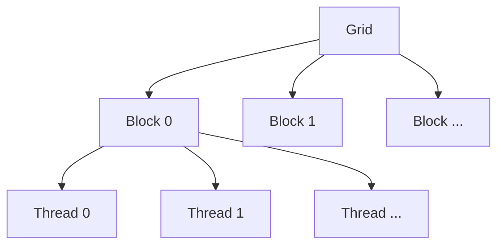

# Lecture 6: Kernels, Triton and XLA

> 课程来源：`context/06 - Lecture 6  Kernels, Triton, XLA 重制版.json`
>
> 本讲从硬件结构进入 kernel 编程：如何把张量操作映射到 GPU，并理解 Triton、CUDA、XLA 这类工具的作用。

## 0. 本讲学习目标

- 理解 kernel 是什么，以及 PyTorch operation 如何对应底层 kernel。
- 描述 thread、block、grid、warp 的关系。
- 理解 memory coalescing、shared memory、bank conflict。
- 解释 kernel fusion 为什么能减少内存流量。
- 理解 Triton 的 program/block 抽象。
- 理解 XLA / compiler-based optimization 的基本思想。

## 1. Kernel 的定义

GPU kernel 是运行在 GPU 上的函数。PyTorch 中一个看似简单的操作：

```python
y = x + 1
```

底层可能启动一个 elementwise kernel。复杂操作如 matmul、softmax、layer norm 也各自对应高度优化的 kernels。

Kernel 优化关注：

- 如何把工作分配给 threads；
- 如何读写内存；
- 如何复用 shared memory；
- 如何避免同步和分支开销；
- 如何提高 occupancy 和 arithmetic intensity。

## 2. Grid、block、thread

CUDA 执行层级：



- Grid: 一次 kernel launch 的所有 blocks。
- Block: 一组可共享 shared memory 并同步的 threads。
- Thread: 执行具体指令的实例。
- Warp: 硬件调度单位，通常 32 threads。

设计 kernel 时要决定：每个 block 负责输出的哪一块，每个 thread 负责哪些元素。

## 3. Elementwise kernel

Elementwise operation 如：

```text
y[i] = gelu(x[i])
```

通常每个元素独立，容易并行。但它的 arithmetic intensity 很低：

```text
read x[i] -> compute small function -> write y[i]
```

因此性能常受 memory bandwidth 限制。

## 4. Reduction kernel

Reduction 如 sum、max、softmax normalization，需要多个元素聚合。

例子：

```text
m = max_i x[i]
s = sum_i exp(x[i] - m)
y[i] = exp(x[i] - m) / s
```

难点：

- threads 之间需要协作；
- 需要同步；
- 数值稳定性重要；
- 数据访问模式影响性能。

Softmax 是 attention 中的关键 reduction，因此优化价值很高。

## 5. Matrix multiplication kernel

矩阵乘法 kernel 通常用 tiling：

```text
C tile = A tile @ B tile
```

流程：

- 一个 block 负责 `C` 的一个 tile。
- 从 HBM 载入 `A` 和 `B` 的小块到 shared memory。
- 多个 threads 复用这些数据计算。
- 累积结果并写回 HBM。

Tiling 的价值在于增加数据复用，降低 HBM 访问次数。

## 6. Memory coalescing

GPU 喜欢连续、对齐的内存访问。如果 warp 中相邻 threads 访问相邻地址，硬件可以合并为高效 memory transaction。

不合并访问会导致：

- 带宽浪费；
- cache 利用差；
- kernel 变慢。

因此张量 layout、stride 和访问顺序非常重要。

## 7. Shared memory 与 bank conflict

Shared memory 被分成多个 banks。若同一 warp 中多个 threads 同时访问同一 bank 的不同地址，会产生 bank conflict，访问被串行化。

避免方法：

- 调整数据 layout；
- padding；
- 改变线程到数据的映射；
- 使用成熟库或 compiler 自动处理。

## 8. Kernel fusion

如果连续执行：

```text
y = x + 1
z = gelu(y)
w = z * scale
```

朴素实现可能启动三个 kernels，并把中间张量写入 HBM。Fusion 把它们合并为一个 kernel：

```text
w = gelu(x + 1) * scale
```

优势：

- 减少 kernel launch overhead；
- 减少中间张量 HBM 读写；
- 提高 memory-bound 操作性能。

限制：

- 复杂 kernel 可能降低 occupancy；
- fusion 后寄存器压力可能增加；
- 不同 shape 和动态控制流会增加编译难度。

## 9. Triton 的编程模型

Triton 提供比 CUDA 更接近张量块的抽象。程序员写的是一个 program instance 处理一个 block/tile。

典型概念：

- `program_id`: 当前 program 负责哪个 tile。
- `tl.arange`: block 内向量化 offsets。
- `tl.load` / `tl.store`: 带 mask 的向量化读写。
- block size: 每个 program 处理的数据块大小。

Triton 适合写：

- fused elementwise kernels；
- custom normalization；
- attention kernels；
- small-to-medium matrix computations；
- research prototype kernels。

## 10. XLA 与 compiler-based optimization

XLA 代表一种 compiler-first 思路：把高层 computation graph 编译成优化后的低层代码。

它可以做：

- operation fusion；
- layout assignment；
- memory planning；
- common subexpression elimination；
- target-specific code generation；
- 跨 op 优化。

与手写 kernel 相比，compiler 优化更自动化，但需要静态 shape、编译时间和良好的图捕获能力。

## 11. Benchmarking kernel

Benchmark 需要注意：

- warmup：先运行几次避免初始化影响；
- synchronization：GPU 异步执行，计时前后需同步；
- input shape：性能高度 shape-specific；
- dtype：FP32/BF16/FP16 会改变吞吐；
- memory allocation：不要把 allocation 时间混进 kernel time；
- correctness：优化后必须与 reference 比较。

## 12. 本讲关键术语

- Kernel: GPU 上执行的函数。
- Kernel launch: CPU 启动 GPU kernel 的动作。
- Grid/block/thread: CUDA 执行层级。
- Warp: GPU 调度单位。
- Tiling: 分块计算以提高数据复用。
- Memory coalescing: 合并连续内存访问。
- Shared memory: block 内共享的高速存储。
- Bank conflict: shared memory bank 访问冲突。
- Kernel fusion: 把多个操作合并成一个 kernel。
- Triton: 用 Python-like DSL 写 GPU kernels 的工具。
- XLA: 面向线性代数的加速编译器。

## 13. 易错点

- 不要只优化 FLOPs，memory traffic 往往更重要。
- 不要忘记 GPU 异步执行，benchmark 时必须同步。
- 不要认为 fused kernel 一定更快，寄存器压力和 occupancy 也会影响性能。
- 不要忽视 shape。一个 kernel 在某个 shape 快，不代表所有 shape 快。
- 不要把 Triton 看成自动魔法，仍需理解 memory 和 tiling。

## 14. 自测题

1. PyTorch 中一个 tensor operation 为什么可能触发 kernel launch？
2. Block 和 thread 的关系是什么？
3. Elementwise kernel 为什么常常 memory-bound？
4. Tiling 如何提升矩阵乘法性能？
5. Memory coalescing 是什么？
6. Bank conflict 为什么会降低 shared memory 性能？
7. Kernel fusion 的主要收益是什么？
8. Triton 相比手写 CUDA 提供了什么抽象？
9. XLA 的优化对象是什么？
10. Benchmark GPU kernel 时为什么要同步？

## 15. 自测题答案

1. PyTorch operation 最终要在硬件上执行。对 GPU tensor，框架会调用或生成 GPU kernel 来完成对应计算。
2. 一个 block 包含多个 threads；同一 block 内 threads 可以通过 shared memory 协作并进行同步。
3. 因为每个元素只做少量计算，但需要从 HBM 读取并写回数据，FLOPs/byte 低。
4. Tiling 把矩阵小块读入 shared memory，在多个乘加中复用，减少昂贵的 HBM 访问。
5. Warp 中相邻 threads 访问连续内存地址时，硬件可把访问合并为更少的 memory transactions。
6. Shared memory 分 bank；多个 threads 同时访问同一 bank 的不同地址会被串行化，降低带宽。
7. 减少 kernel launch 次数和中间张量 HBM 读写，尤其能加速 memory-bound 操作。
8. Triton 让程序员以 block/tile 和向量化 load/store 表达计算，少处理 CUDA 的低层细节。
9. 它优化高层 computation graph，包括 op fusion、layout、memory planning 和 target-specific codegen。
10. GPU kernel launch 是异步的；不同步会只测到提交任务时间，而不是实际执行时间。
