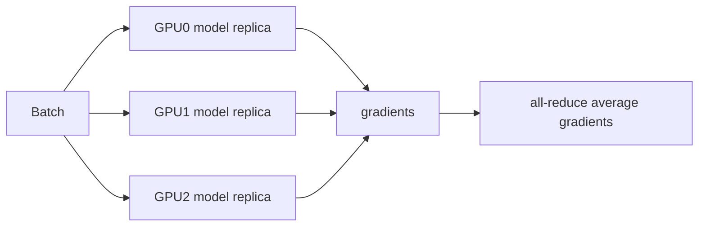

# Lecture 7: Parallelism Fundamentals

> 课程来源：`context/07 - Lecture 7  Parallelism 重制版.json`
>
> 本讲从单 GPU 优化进入多 GPU 训练，重点是 data parallelism、collectives、DDP、ZeRO/FSDP 和 pipeline/tensor parallelism 的基本概念。

## 0. 本讲学习目标

- 理解为什么大模型训练需要 parallelism。
- 解释 data parallelism 和 DDP 的执行流程。
- 理解 all-reduce、reduce-scatter、all-gather 等 collective communication。
- 理解 ZeRO 和 FSDP 如何节省 optimizer、gradient、parameter memory。
- 初步理解 tensor parallelism 和 pipeline parallelism 的切分思路。

## 1. 为什么需要多 GPU

单张 GPU 的限制主要有：

- 显存不足以容纳 parameters、optimizer states、gradients 和 activations。
- 计算吞吐不足，训练时间过长。
- batch size、sequence length 或模型规模无法继续扩大。

Parallelism 的目标是把模型训练拆到多个 devices 上，同时尽量减少 communication overhead。

## 2. Rank、world size 与 process group

分布式训练中常用术语：

- rank: 一个进程或设备的编号。
- world size: 总 rank 数。
- local rank: 当前机器内的 GPU 编号。
- process group: 参与 collective communication 的进程集合。

每个 rank 通常绑定一张 GPU，执行同一段训练代码，但处理不同数据或模型切片。

## 3. Data parallelism

Data parallelism 是最基本的并行方式：

```text
每张 GPU 保存完整模型
每张 GPU 处理不同 mini-batch shard
反向传播后同步 gradients
每张 GPU 执行相同 optimizer step
```

示意图：



优点：

- 概念简单；
- 计算扩展性好；
- 每个 GPU 上执行完整 forward/backward。

缺点：

- 每张 GPU 都要保存完整模型和 optimizer states；
- gradient synchronization 有通信成本。

## 4. DDP 的执行流程

DistributedDataParallel / DDP 的典型流程：

1. 每个 rank 读取不同数据 shard。
2. 每个 rank 用完整模型做 forward。
3. 每个 rank 做 backward，得到本地 gradients。
4. 对 gradients 执行 all-reduce，得到全局平均梯度。
5. 每个 rank 执行相同 optimizer step。

DDP 的关键优化是 communication overlap：反向传播到某一层的 gradients 准备好后，就可以开始通信，而不必等整个 backward 完成。

## 5. Collective communication

常见 collectives：

- all-reduce: 所有 rank 的张量求和/平均，并把结果返回给所有 rank。
- reduce-scatter: 先 reduce，再把结果切片分发给各 rank。
- all-gather: 每个 rank 持有一片，最后所有 rank 都收集到完整张量。
- broadcast: 一个 rank 把数据发送给所有 rank。

这些操作的性能取决于：

- GPU 间带宽；
- 拓扑，例如 NVLink、PCIe、InfiniBand；
- message size；
- collective algorithm。

## 6. Ring all-reduce 的直觉

Ring all-reduce 把 ranks 排成环，每个 rank 只与相邻 rank 通信。它通常分两阶段：

- reduce-scatter：沿环传播并累加数据块。
- all-gather：沿环传播最终数据块，使所有 rank 拥有完整结果。

优点是带宽利用率高，缺点是延迟随 rank 数增长。

## 7. ZeRO 的核心思想

DDP 的问题是每个 rank 都保存完整训练状态。ZeRO / Zero Redundancy Optimizer 消除冗余。

分阶段理解：

- ZeRO-1: shard optimizer states。
- ZeRO-2: shard optimizer states 和 gradients。
- ZeRO-3: shard optimizer states、gradients 和 parameters。

核心思想：

```text
不要让每张 GPU 保存完整状态；只保存自己负责的 shard，需要时通信恢复。
```

## 8. FSDP

Fully Sharded Data Parallel / FSDP 可看作 PyTorch 生态中常用的 ZeRO-3 风格实现。

典型流程：

```text
before layer forward: all-gather parameters
compute forward
free or reshard parameters
backward: all-gather needed parameters
compute gradients
reduce-scatter gradients
optimizer updates local shards
```

它用通信换显存，使更大模型能在有限 GPU memory 上训练。

## 9. Tensor parallelism

Tensor parallelism 把单层中的矩阵计算切到多个 GPU。

例子：线性层 `Y = XW`

- column parallel: 按输出维度切 `W`。
- row parallel: 按输入维度切 `W`，需要 reduce。

它适合单层矩阵太大或单 GPU 计算不够时使用，但会在层内引入频繁通信。

## 10. Pipeline parallelism

Pipeline parallelism 把模型层按深度切分到不同 GPU：

```text
GPU0: layers 0-7
GPU1: layers 8-15
GPU2: layers 16-23
```

为了提高利用率，batch 被拆成 microbatches 流水线执行。

主要问题是 bubble：流水线开始和结束阶段有设备空闲。microbatch 数越多，bubble 相对越小，但 activation 和调度复杂性增加。

## 11. Parallelism 的选择

实际训练通常组合多种 parallelism：

- 模型较小但数据大：data parallelism。
- optimizer states 放不下：FSDP/ZeRO。
- 单层矩阵太大：tensor parallelism。
- 层数太多或模型太深：pipeline parallelism。
- MoE 模型：expert parallelism。

选择并行策略时要同时考虑显存、计算、通信、网络拓扑和实现复杂度。

## 12. 本讲关键术语

- Rank: 分布式训练中的进程/GPU 编号。
- World size: 总 rank 数。
- DDP: 每卡完整模型、同步梯度的数据并行。
- Collective: 多 rank 协作通信操作。
- All-reduce: 所有 rank 求和并获得同样结果。
- Reduce-scatter: reduce 后分片。
- All-gather: 收集所有分片。
- ZeRO: 消除 optimizer/gradient/parameter 冗余的并行策略。
- FSDP: Fully Sharded Data Parallel。
- Tensor parallelism: 切分层内张量计算。
- Pipeline parallelism: 按层切分模型。
- Bubble: pipeline 中设备空闲阶段。

## 13. 易错点

- 不要认为 data parallelism 能解决模型放不下的问题。DDP 每卡仍保存完整模型。
- 不要把 all-reduce 和 all-gather 混淆。前者聚合数值，后者收集分片。
- 不要忽略 optimizer states。它们常常比参数本身更占显存。
- 不要认为通信可以免费扩展。网络拓扑会决定上限。
- 不要把 FSDP 理解成只省参数，它也改变 gradients 和 optimizer states 的存储方式。

## 14. 自测题

1. DDP 中每个 GPU 是否保存完整模型？
2. DDP 为什么需要 all-reduce gradients？
3. reduce-scatter 和 all-gather 分别做什么？
4. ZeRO-1、ZeRO-2、ZeRO-3 的差异是什么？
5. FSDP 为什么能训练更大模型？
6. Tensor parallelism 切分的是模型的哪一部分？
7. Pipeline parallelism 中 bubble 是什么？
8. 为什么 microbatch 能改善 pipeline 利用率？
9. 什么时候 DDP 不是合适选择？
10. 网络拓扑为什么影响并行训练性能？

## 15. 自测题答案

1. 是。标准 DDP 中每个 GPU 都有完整模型副本。
2. 因为每个 GPU 只看了不同数据 shard，本地梯度不同；all-reduce 得到全局平均梯度，使所有副本执行一致更新。
3. Reduce-scatter 先对所有 rank 的数据求和/聚合，再把结果分片给各 rank；all-gather 把各 rank 的分片收集成完整张量。
4. ZeRO-1 shard optimizer states，ZeRO-2 进一步 shard gradients，ZeRO-3 再 shard parameters。
5. 它只让每个 rank 常驻一部分参数、梯度和 optimizer states，需要计算某层时再 all-gather 参数，用通信换显存。
6. 它切分单层内部的矩阵或 attention heads 等张量计算，而不是只切数据 batch。
7. Pipeline 启动和排空期间部分 stage 没有 microbatch 可处理，设备处于空闲状态，这段空闲就是 bubble。
8. 更多 microbatches 让不同 pipeline stages 更连续地同时工作，减少 bubble 在总时间中的比例。
9. 当单卡放不下完整模型/optimizer states，或单层计算需要跨卡切分时，单纯 DDP 不够。
10. Collective communication 的速度取决于 GPU 间链路带宽和延迟；NVLink、PCIe、InfiniBand 的性能差异会直接影响训练效率。
